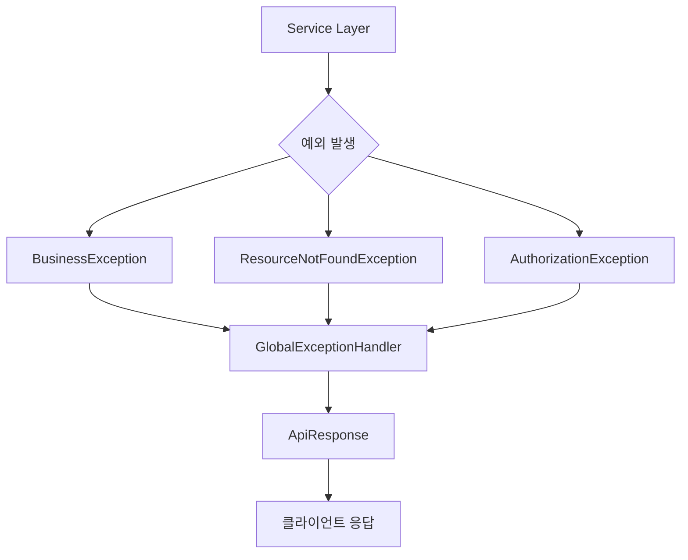

# AgenticCP 예외 처리 가이드라인

## 📋 목차

1. [공통 예외 처리의 목표](#공통-예외-처리의-목표)
2. [예외 처리 구조](#예외-처리-구조)
3. [도메인별 에러 코드 카테고리 관리](#도메인별-에러-코드-카테고리-관리)
4. [BaseErrorCode 인터페이스](#baseerrorcode-인터페이스)
5. [각 예외를 언제 던지는지](#각-예외를-언제-던지는지)
6. [ApiResponse 응답 형식](#apiresponse-응답-형식)

---

## 🎯 공통 예외 처리의 목표

### 1. 일관된 에러 응답
- 모든 API가 동일한 형식으로 에러를 반환
- 클라이언트가 예측 가능한 에러 응답 구조 제공

### 2. 명확한 예외 분류
- 상황에 맞는 적절한 예외 타입 사용
- 비즈니스 로직과 시스템 오류의 명확한 구분

---

## 🏗️ 예외 처리 구조

### 1. 예외 처리 흐름



### 2. 핵심 컴포넌트

- **`BusinessException`**: 모든 비즈니스 예외의 최상위 클래스
- **`BaseErrorCode`**: 에러 코드 인터페이스 (HTTP 상태, 코드, 메시지 정의)
- **`ErrorCategory`**: 도메인별 에러 코드 카테고리 관리
- **`GlobalExceptionHandler`**: 전역 예외 처리 및 ApiResponse 변환

### 3. GlobalExceptionHandler 처리 흐름

```java
public class GlobalExceptionHandler {
    
    // 1. 비즈니스 예외 처리
    handleBusinessException(BusinessException e) {
        // BaseErrorCode를 ApiResponse로 변환
        return ResponseEntity.status(e.getErrorCode().getHttpStatus())
                .body(ApiResponse.error(e.getErrorCode(), e.getMessage()));
    }
    
    // 2. 시스템 예외 처리 (DB, 네트워크 등)
    handleDataAccessException(DataAccessException e) {
        // 시스템 오류는 CommonErrorCode 사용
        return ResponseEntity.status(HttpStatus.INTERNAL_SERVER_ERROR)
                .body(ApiResponse.error(CommonErrorCode.DATABASE_ERROR));
    }
    
    // 3. 유효성 검증 예외 처리
    handleValidationException(MethodArgumentNotValidException e) {
        // 필드별 에러 정보를 포함한 응답
        return ResponseEntity.status(HttpStatus.BAD_REQUEST)
                .body(ApiResponse.error(CommonErrorCode.FIELD_VALIDATION_ERROR, fieldErrors));
    }
}
```

---

## 🏷️ 도메인별 에러 코드 카테고리 관리

### 1. ErrorCategory 사용법

```java
public enum ErrorCategory {
    COMMON("COMMON_"),    // 공통 에러 (500, 400, 404 등)
    AUTH("AUTH_"),        // 인증/인가 관련
    USER("USER_"),        // 사용자 관련
    TENANT("TENANT_");    // 테넌트 관련
}
```

### 2. 언제 사용하는가?

- **새로운 도메인 추가 시**: `PRODUCT("PRODUCT_")` 같은 카테고리 추가
- **에러 코드 생성 시**: `ErrorCategory.USER.generate(1001)` → `"USER_1001"`

### 3. 에러 코드 번호 범위 정의

```java
// 도메인별 에러 코드 번호 범위 (COMMON 제외 1000 단위로 구분)

COMMON: HTTP 상태 코드 번호 그대로 사용
// 공통 에러 (시스템, 유효성 검증 등) - 404, 500 등

[예시]
AUTH:   1000-1999     // 인증/인가 관련
USER:   2000-2999     // 사용자 관리
TENANT: 3000-3999     // 테넌트 관리
AWS:  4000-4999       // aws 리소스 관리
COST:   7000-7999     // 비용 관리
MONITORING: 8000-8999 // 모니터링 및 알림
```

> ⚠️ **중요**: 새로운 도메인 에러 코드를 추가할 때는 반드시 할당된 번호 범위 내에서만 사용하세요.
> 다른 도메인의 번호 범위를 침범하거나 중복 사용하면 안 됩니다.
> 예: USER 도메인은 2000-2999 범위만 사용, TENANT 도메인은 3000-3999 범위만 사용


### 4. 예시 코드

```java
// 사용자 도메인 에러 코드
public enum UserErrorCode implements BaseErrorCode {
    USER_NOT_FOUND(HttpStatus.NOT_FOUND, 2001, "사용자를 찾을 수 없습니다."),
    DUPLICATE_EMAIL(HttpStatus.CONFLICT, 2002, "이미 사용 중인 이메일입니다."),
    INVALID_USER_STATUS(HttpStatus.BAD_REQUEST, 2003, "유효하지 않은 사용자 상태입니다."),
    USER_ALREADY_DELETED(HttpStatus.BAD_REQUEST, 2004, "이미 삭제된 사용자입니다.");
    
    @Override
    public String getCode() {
        return ErrorCategory.USER.generate(codeNumber); // "USER_2001"
    }
}

// 테넌트 도메인 에러 코드
public enum TenantErrorCode implements BaseErrorCode {
    TENANT_NOT_FOUND(HttpStatus.NOT_FOUND, 3001, "테넌트를 찾을 수 없습니다."),
    TENANT_QUOTA_EXCEEDED(HttpStatus.BAD_REQUEST, 3002, "테넌트 할당량을 초과했습니다."),
    TENANT_SUSPENDED(HttpStatus.FORBIDDEN, 3003, "일시정지된 테넌트입니다.");
    
    @Override
    public String getCode() {
        return ErrorCategory.TENANT.generate(codeNumber); // "TENANT_3001"
    }
}
```

---

## 🔧 BaseErrorCode 인터페이스

### 1. 인터페이스 정의

```java
public interface BaseErrorCode {
    HttpStatus getHttpStatus();  // HTTP 상태 코드
    String getCode();           // 에러 코드 (예: "USER_1001")
    String getMessage();        // 에러 메시지
}
```


### 2. CommonErrorCode 사용 시점

```java
// ✅ 시스템 레벨 오류
- 데이터베이스 연결 실패
- 서버 내부 오류
- 잘못된 HTTP 메서드
- 필수 파라미터 누락

// ❌ 비즈니스 로직 오류 (도메인별로 BaseErrorCode implements -> 해당 도메인 ErrorCode 구현)
- 사용자 중복 가입
- 권한 부족
- 비즈니스 규칙 위반
```

---

## ⚠️ 각 예외를 언제 던지는지

### 1. BusinessException - 비즈니스 예외의 부모 클래스

**언제 사용:**
- 비즈니스 로직에서 예측 가능한 예외 상황
- 개발자 실수나 시스템 장애가 아닌 경우
- 사용자 입력이나 비즈니스 규칙 위반 시

**예시 코드:**
```java
@Service
public class UserService {
    
    public void updateUser(UserUpdateDto dto) {
        if (isNicknameDuplicate(dto.getNickname())) {
            throw new BusinessException(UserErrorCode.DUPLICATE_NICKNAME);
        }
        
        if (dto.getAge() < 18) {
            throw new BusinessException(UserErrorCode.UNDERAGE_USER, "만 18세 미만은 가입할 수 없습니다.");
        }
    }
}
```

### 2. ResourceNotFoundException - 데이터가 없을 때 (404)

**언제 사용:**
- 데이터베이스 조회 결과가 없을 때
- NPE 대신 명확한 "데이터 없음" 상황 표현
- 리소스가 존재하지 않음을 클라이언트에게 알릴 때

**예시 코드:**
```java
@Service
public class UserService {
    
    public User findUserById(Long userId) {
        return userRepository.findById(userId)
                .orElseThrow(() -> new ResourceNotFoundException(UserErrorCode.USER_NOT_FOUND));
    }
    
    public void deleteUser(Long userId) {
        User user = findUserById(userId); // 위에서 ResourceNotFoundException 발생 가능
        userRepository.delete(user);
    }
}
```

### 3. AuthorizationException - 권한이 없을 때 (403)

**언제 사용:**
- 인증은 되었지만 특정 리소스에 대한 권한이 없을 때
- 역할 기반 접근 제어에서 권한 확인 실패 시
- 리소스 소유권 확인 실패 시

> 💡 **권장사항**: 권한 관련 예외를 던질 때는 `AuthorizationException` 클래스를 반드시 확인하고,
> 상황에 맞는 적절한 생성자를 선택하여 구현하기를 강력히 추천합니다.
> 이 클래스는 이미 다양한 권한 확인 시나리오를 고려하여 설계되었습니다.

**생성자 종류:**
```java
// 1. 기본 생성자 - 단순 권한 없음
new AuthorizationException()

// 2. 리소스별 권한 확인 - 특정 리소스에 대한 특정 액션 권한 없음
new AuthorizationException(userId, "Post", "delete")

// 3. 역할 기반 권한 확인 - 특정 역할이 필요한데 없음
new AuthorizationException(userId, "ADMIN")

// 4. 사용자별 권한 확인 - 특정 사용자의 접근 권한 없음
new AuthorizationException(userId)
```

**💡 AuthorizationException params에 포함되는 Resource와 Action이란?**
- **리소스**: 접근하려는 대상 객체나 기능 (예: `"Post"`, `"User"`, `"Tenant"`, `"SecurityPolicy"`)
- **액션**: 리소스에 대해 수행하려는 작업 (예: `"create"`, `"read"`, `"update"`, `"delete"`, `"modify"`)

**리소스-액션 조합 예시:**
```java
// 게시물 삭제 권한 없음
new AuthorizationException(userId, "Post", "delete")

// 사용자 정보 수정 권한 없음  
new AuthorizationException(userId, "User", "update")

// 테넌트 설정 변경 권한 없음
new AuthorizationException(userId, "Tenant", "modify")

// 보안 정책 조회 권한 없음
new AuthorizationException(userId, "SecurityPolicy", "read")
```

**예시 코드:**
```java
@Service
public class UserService {
    
    public void deletePost(Long userId, Long postId) {
        Post post = postRepository.findById(postId)
                .orElseThrow(() -> new ResourceNotFoundException(PostErrorCode.POST_NOT_FOUND));
        
        // 소유권 확인 - 게시물의 소유자가 아니므로 권한 없음
        if (!post.getOwnerId().equals(userId)) {
            throw new AuthorizationException(userId, "Post", "delete");
        }
        
        postRepository.delete(post);
    }
    
    public void updateUserRole(Long adminUserId, Long targetUserId, String newRole) {
        // 관리자 권한 확인
        if (!hasAdminRole(adminUserId)) {
            throw new AuthorizationException(adminUserId, "ADMIN");
        }
        
        // 사용자별 권한 확인
        if (targetUserId.equals(adminUserId)) {
            throw new AuthorizationException(adminUserId);
        }
        
        userRepository.updateRole(targetUserId, newRole);
    }
}
```

### 4. 커스텀 예외 생성 가이드

**새로운 도메인 예외 생성 시:**
```java
// 1. ErrorCategory에 새 카테고리 추가 (번호 범위와 함께)
public enum ErrorCategory {
    COMMON("COMMON_"),      // 0000-0999
    AUTH("AUTH_"),          // 1000-1999
    USER("USER_"),          // 2000-2999
    TENANT("TENANT_"),      // 3000-3999
    CLOUD("CLOUD_"),        // 4000-4999
    SECURITY("SECURITY_"),  // 5000-5999
    PLATFORM("PLATFORM_"),  // 6000-6999
    COST("COST_"),          // 7000-7999
    MONITORING("MONITORING_"), // 8000-8999
    INTEGRATION("INTEGRATION_"); // 9000-9999
}

// 2. 도메인별 ErrorCode Enum 생성 (해당 범위 내에서)
public enum CloudErrorCode implements BaseErrorCode {
    CLOUD_PROVIDER_NOT_FOUND(HttpStatus.NOT_FOUND, 4001, "클라우드 프로바이더를 찾을 수 없습니다."),
    INSUFFICIENT_CLOUD_QUOTA(HttpStatus.BAD_REQUEST, 4002, "클라우드 할당량이 부족합니다."),
    CLOUD_SERVICE_UNAVAILABLE(HttpStatus.SERVICE_UNAVAILABLE, 4003, "클라우드 서비스를 사용할 수 없습니다.");
    
    @Override
    public String getCode() {
        return ErrorCategory.CLOUD.generate(codeNumber); // "CLOUD_4001"
    }
}

// 3. 필요시 커스텀 예외 클래스 생성 (선택사항)
public class CloudException extends BusinessException {
    public CloudException(CloudErrorCode errorCode) {
        super(errorCode);
    }
}
```

### 5. 에러 코드 번호 관리 규칙

```java
// ✅ 좋은 예 - 도메인별 범위 준수
USER_NOT_FOUND(2001)        // USER 도메인 범위 (2000-2999)
TENANT_QUOTA_EXCEEDED(3002) // TENANT 도메인 범위 (3000-3999)
CLOUD_SERVICE_ERROR(4001)   // CLOUD 도메인 범위 (4000-4999)

// ❌ 나쁜 예 - 범위 초과
USER_NOT_FOUND(5001)        // USER 도메인 범위를 벗어남
TENANT_ERROR(2001)          // TENANT 도메인이지만 USER 범위 사용
```

---

## 📤 ApiResponse 응답 형식

### 1. 성공 응답

```java
// 데이터만 포함
ApiResponse.success(userData)

// 메시지와 함께
ApiResponse.success(userData, "사용자 정보를 성공적으로 조회했습니다.")
```

**응답 예시:**
```json
{
  "success": true,
  "data": {
    "id": 1,
    "name": "홍길동",
    "email": "hong@example.com"
  },
  "timestamp": "2024-01-15T10:30:00Z"
}
```

### 2. 에러 응답

```java
// 단순 에러
ApiResponse.error(UserErrorCode.USER_NOT_FOUND)

// 커스텀 메시지와 함께
ApiResponse.error(UserErrorCode.DUPLICATE_EMAIL, "이미 사용 중인 이메일입니다.")

// 필드별 유효성 검증 에러
ApiResponse.error(CommonErrorCode.FIELD_VALIDATION_ERROR, fieldErrors)
```

**응답 예시:**
```json
{
  "success": false,
  "errorCode": "USER_1001",
  "message": "사용자를 찾을 수 없습니다.",
  "timestamp": "2024-01-15T10:30:00Z"
}
```

### 3. 유효성 검증 에러 응답

```json
{
  "success": false,
  "errorCode": "COMMON_422",
  "message": "필드 유효성 검증에 실패했습니다.",
  "fieldErrors": [
    {
      "field": "email",
      "value": "invalid-email",
      "reason": "올바른 이메일 형식이 아닙니다."
    },
    {
      "field": "age",
      "value": -5,
      "reason": "나이는 0 이상이어야 합니다."
    }
  ],
  "timestamp": "2024-01-15T10:30:00Z"
}
```

---

## 📝 요약

1. **일관성**: 모든 예외는 `BusinessException` 계층구조를 따름
2. **명확성**: 도메인별 `ErrorCode`로 명확한 에러 분류
3. **표준화**: `ApiResponse`로 통일된 응답 형식
4. **확장성**: 새로운 도메인 추가 시 `ErrorCategory` 확장
5. **안전성**: 시스템 오류와 비즈니스 오류의 명확한 구분
