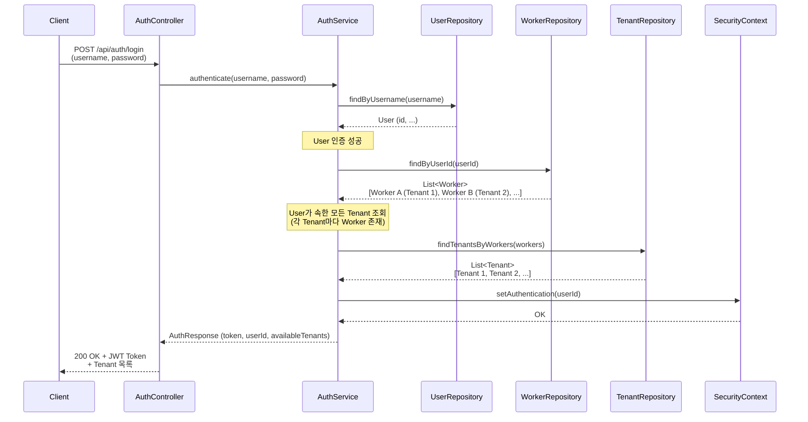
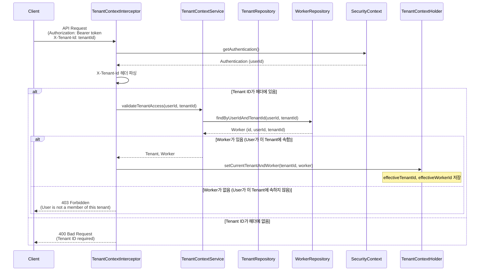
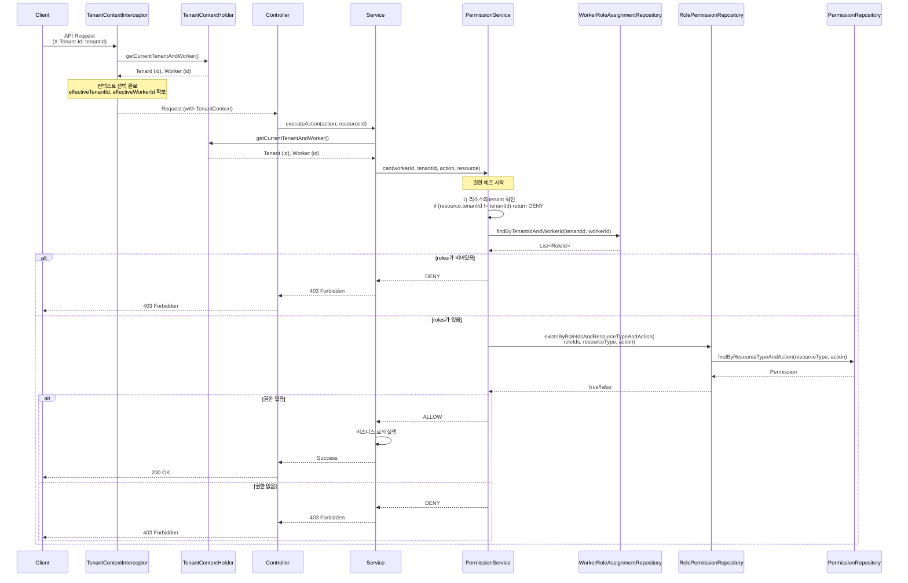
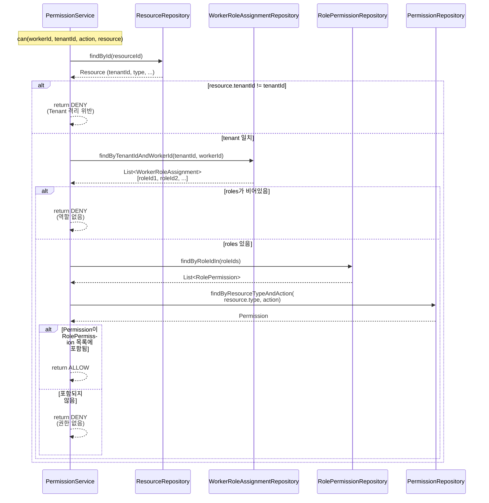
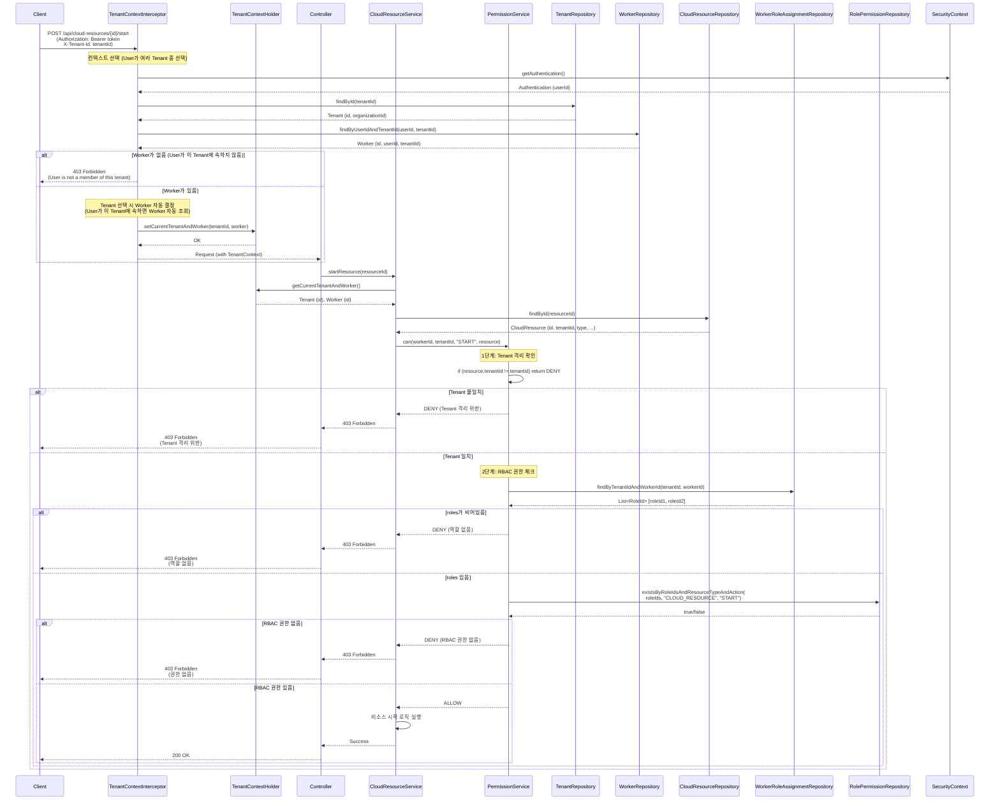

# RBAC 권한 체크 시퀀스 다이어그램

## 시나리오 개요

### 시나리오: User ↔ Worker (1:N), Worker → Tenant (N:1)
- **User ↔ Worker (1:N)**: 한 User는 여러 Worker를 가질 수 있음
- **Worker → Tenant (N:1)**: Worker는 하나의 Tenant에만 속함
- **User가 여러 Tenant에 속할 수 있음**: 각 Tenant마다 Worker가 다름
- **컨텍스트 선택 필요**: User가 여러 Tenant 중 하나를 선택해야 함
- **Worker 결정**: Tenant 선택 시 해당 Tenant의 Worker 자동 조회

### 핵심 원칙
- **User는 조직(테넌트)이 정해지면 Worker도 정해진다**
- **Worker는 Tenant에 종속적** → Worker를 직접 선택할 필요 없음
- **Tenant 선택** → 해당 Tenant의 Worker 자동 결정

### 전제 조건
- **Tenant ↔ Organization (1:1)**: Tenant와 Organization은 1:1 관계

---

## 1. 사용자 로그인 및 Tenant 목록 조회 시퀀스



---

## 2. 컨텍스트 선택 및 Tenant/Worker 결정 시퀀스



---

## 3. API 요청 및 권한 체크 시퀀스



---

## 4. 상세 권한 체크 흐름 (can 메서드 내부)



---

## 5. 클라우드 리소스 접근 시퀀스



### 권한 체크 흐름 요약

1. **Tenant 격리 확인**: `resource.tenantId == tenantId`
2. **RBAC 권한 체크**: 
   - Worker의 Role 조회 (`WorkerRoleAssignment`)
   - Role의 Permission 확인 (`RolePermission`)
   - `resourceType`과 `action`에 대한 권한 확인

**권한 체크 함수**: `PermissionService.can(workerId, tenantId, action, resource)`

---

## 6. SecurityContext 및 TenantContext 구조

```mermaid
classDiagram
    class SecurityContext {
        +Authentication getAuthentication()
        +void setAuthentication(Authentication)
    }
    
    class Authentication {
        +Long userId
        +String username
        +List~String~ authorities
    }
    
    class TenantContextHolder {
        +Tenant getCurrentTenant()
        +Worker getCurrentWorker()
        +void setCurrentTenantAndWorker(Tenant, Worker)
        +void clear()
    }
    
    class Tenant {
        +Long id
        +String tenantKey
        +Long organizationId
    }
    
    class Worker {
        +Long id
        +Long userId
        +Long tenantId
        +String workerKey
    }
    
    class User {
        +Long id
        +String username
        +String email
    }
    
    SecurityContext --> Authentication
    Authentication --> User : "1:1"
    TenantContextHolder --> Tenant : "현재 선택된 Tenant"
    TenantContextHolder --> Worker : "현재 선택된 Worker"
    User --> Worker : "1:N (각 Tenant마다)"
    Worker --> Tenant : "N:1"
    Tenant --> Organization : "1:1"
```

---

## 7. 주요 설계 요소

### 필요한 컴포넌트
- ✅ `TenantContextService` - User가 속한 Tenant 목록 조회 및 Tenant 선택 검증
- ✅ `TenantContextInterceptor` - HTTP 헤더(`X-Tenant-Id`)에서 Tenant 선택
- ✅ `TenantContextHolder` - 현재 선택된 Tenant/Worker 저장 (ThreadLocal)

### 흐름
1. **로그인 시**: User → 모든 Tenant 조회 (1:N) → Client에 Tenant 목록 반환
2. **요청 시**: Client가 `X-Tenant-Id` 헤더로 Tenant 선택 → 해당 Tenant의 Worker 자동 조회 → `TenantContextHolder`에 저장
3. **권한 체크**: `TenantContextHolder`에서 `workerId`, `tenantId` 가져와서 `can(workerId, tenantId, action, resource)` 호출

### 권한 체크 로직
```java
function can(workerId, tenantId, action, resource) {
  // 0) 리소스의 tenant 확인
  if (resource.tenantId != tenantId) return DENY

  // 1) 이 테넌트에서 worker에게 할당된 role 목록
  roles = WorkerRoleAssignment
            .where(tenantId, workerId)
            .map(roleId)

  if roles.empty? return DENY

  // 2) role들이 이 resourceType에 대해 action 허용하는지
  return RolePermission.exists(
    roleId in roles,
    resourceType = resource.type,
    action = action
  )
}
```

---

## 8. 구현 시 주의사항

1. **Worker 엔티티 구조**
   - `Worker.userId` (FK) - User와 N:1 관계 (한 User가 여러 Tenant에 속할 수 있음)
   - `Worker.tenantId` (FK) - Tenant와 N:1 관계 (하나의 Tenant에만 속함)
   - `Worker.workerKey` (unique) - Worker 식별자

2. **컨텍스트 선택 레이어**
   - 로그인 시: User가 속한 모든 Tenant 목록 반환
   - 요청 시: `X-Tenant-Id` 헤더로 Tenant 선택 (필수)
   - `TenantContextInterceptor`에서 Tenant 선택 후 해당 Tenant의 Worker 자동 조회
   - `TenantContextHolder`에 Tenant/Worker 저장

3. **권한 체크 서비스**
   - `PermissionService.can()` 메서드는 `TenantContextHolder`에서 `workerId`, `tenantId`를 가져옴
   - Tenant 선택이 안 되어 있으면 예외 발생

4. **Tenant 선택 검증**
   - `TenantContextService.validateTenantAccess(userId, tenantId)`로
   - 해당 Tenant에 User의 Worker가 존재하는지 확인 (보안)
   - Worker 존재 여부로 User가 해당 Tenant에 속하는지 검증

## 9. 예시 시나리오

### User가 여러 Tenant에 속한 경우

**상황:**
- User A (김연수)가 두 개의 Tenant에 속함
  - Tenant 1 (LG CNS): Worker 1 - `ORG_ADMIN` 역할
  - Tenant 2 (이화여대): Worker 2 - `VIEWER` 역할

**흐름:**
1. 로그인 시: User A가 속한 Tenant 목록 반환 `[Tenant 1, Tenant 2]`
2. Tenant 1 리소스 조회 시: `X-Tenant-Id: 1` 헤더로 Tenant 1 선택 → Worker 1 자동 조회
3. 권한 체크: Worker 1의 `ORG_ADMIN` 역할로 권한 확인 → ALLOW
4. Tenant 2 리소스 조회 시: `X-Tenant-Id: 2` 헤더로 Tenant 2 선택 → Worker 2 자동 조회
5. 권한 체크: Worker 2의 `VIEWER` 역할로 권한 확인 → ALLOW (read만 가능)

---

## 10. 데이터베이스 스키마

### 10.1 DBML 스키마 (dbdiagram.io)

```dbml
Table organizations {
  id bigint [pk]
  name varchar [not null]
  created_at datetime
  updated_at datetime
  is_deleted boolean
}

Table tenants {
  id bigint [pk]
  tenant_key varchar [unique, not null]
  tenant_name varchar [not null]
  organization_id bigint [not null, ref: > organizations.id]
  status varchar
  created_at datetime
  updated_at datetime
  is_deleted boolean
}

Table users {
  id bigint [pk]
  username varchar [unique, not null]
  email varchar [unique, not null]
  name varchar [not null]
  password_hash varchar
  status varchar
  created_at datetime
  updated_at datetime
  is_deleted boolean
}

Table organization_users {
  id bigint [pk]
  organization_id bigint [not null, ref: > organizations.id]
  user_id bigint [not null, ref: > users.id]
  org_role varchar "조직 내 역할 (ORG_ADMIN, ORG_MEMBER 등)"
  status varchar
  created_at datetime
  updated_at datetime
  is_deleted boolean
}

Table workers {
  id bigint [pk]
  worker_key varchar [unique, not null]
  worker_name varchar [not null]
  tenant_id bigint [not null, ref: > tenants.id]
  organization_id bigint [ref: > organizations.id]
  user_id bigint [not null, ref: > users.id]
  status varchar
  created_at datetime
  updated_at datetime
  is_deleted boolean
}

Table roles {
  id bigint [pk]
  role_key varchar [not null]
  role_name varchar [not null]
  description varchar
  tenant_id bigint [not null, ref: > tenants.id]
  status varchar
  is_system boolean
  is_default boolean
  priority int
  created_at datetime
  updated_at datetime
  is_deleted boolean
}

Table permissions {
  id bigint [pk]
  permission_key varchar [not null]
  permission_name varchar [not null]
  description varchar
  tenant_id bigint [not null, ref: > tenants.id]
  resource_type varchar [not null]
  action varchar [not null]
  status varchar
  is_system boolean
  category varchar
  priority int
  created_at datetime
  updated_at datetime
  is_deleted boolean
}

Table role_permissions {
  id bigint [pk]
  role_id bigint [not null, ref: > roles.id]
  permission_id bigint [not null, ref: > permissions.id]
  created_at datetime
  updated_at datetime
  is_deleted boolean
}

Table worker_role_assignments {
  id bigint [pk]
  tenant_id bigint [not null, ref: > tenants.id]
  worker_id bigint [not null, ref: > workers.id]
  role_id bigint [not null, ref: > roles.id]
  assigned_by varchar
  assigned_at datetime
  expires_at datetime
  created_at datetime
  updated_at datetime
  is_deleted boolean
}

Table cloud_resources {
  id bigint [pk]
  resource_id varchar [unique, not null]
  name varchar [not null]
  provider varchar [not null]
  region varchar [not null]
  type varchar [not null]
  tenant_id bigint [not null, ref: > tenants.id]
  labels jsonb
  properties jsonb "쿠버네티스 Spec (선언된 상태/설정)"
  status jsonb "쿠버네티스 Status (관측된 상태/런타임 정보)"
  created_at datetime
  updated_at datetime
  is_deleted boolean
}

Table cloud_resource_worker_map {
  id bigint [pk]
  cloud_resource_id bigint [not null, ref: > cloud_resources.id]
  worker_id bigint [not null, ref: > workers.id]
  access_type varchar "CREATOR, ORGANIZATION, GRANTED"
  grant_reason varchar
  granted_by varchar
  expires_at datetime
  created_at datetime
  updated_at datetime
  is_deleted boolean
}
```

### 10.2 SQL DDL 스키마

```sql
-- Organizations
CREATE TABLE organizations (
    id BIGINT AUTO_INCREMENT PRIMARY KEY,
    name VARCHAR(255) NOT NULL,
    created_at DATETIME NOT NULL DEFAULT CURRENT_TIMESTAMP,
    updated_at DATETIME NOT NULL DEFAULT CURRENT_TIMESTAMP ON UPDATE CURRENT_TIMESTAMP,
    created_by VARCHAR(255),
    updated_by VARCHAR(255),
    is_deleted BOOLEAN NOT NULL DEFAULT FALSE
);

-- Tenants
CREATE TABLE tenants (
    id BIGINT AUTO_INCREMENT PRIMARY KEY,
    tenant_key VARCHAR(100) NOT NULL UNIQUE,
    tenant_name VARCHAR(255) NOT NULL,
    organization_id BIGINT NOT NULL,
    status VARCHAR(20) NOT NULL DEFAULT 'ACTIVE',
    created_at DATETIME NOT NULL DEFAULT CURRENT_TIMESTAMP,
    updated_at DATETIME NOT NULL DEFAULT CURRENT_TIMESTAMP ON UPDATE CURRENT_TIMESTAMP,
    created_by VARCHAR(255),
    updated_by VARCHAR(255),
    is_deleted BOOLEAN NOT NULL DEFAULT FALSE,
    CONSTRAINT fk_tenant_organization FOREIGN KEY (organization_id) REFERENCES organizations(id)
);

CREATE INDEX idx_tenants_organization ON tenants(organization_id);
CREATE INDEX idx_tenants_key ON tenants(tenant_key);

-- Users
CREATE TABLE users (
    id BIGINT AUTO_INCREMENT PRIMARY KEY,
    username VARCHAR(50) NOT NULL UNIQUE,
    email VARCHAR(255) NOT NULL UNIQUE,
    name VARCHAR(100) NOT NULL,
    password_hash VARCHAR(255),
    organization_id BIGINT,
    status VARCHAR(20) NOT NULL DEFAULT 'PENDING',
    created_at DATETIME NOT NULL DEFAULT CURRENT_TIMESTAMP,
    updated_at DATETIME NOT NULL DEFAULT CURRENT_TIMESTAMP ON UPDATE CURRENT_TIMESTAMP,
    created_by VARCHAR(255),
    updated_by VARCHAR(255),
    is_deleted BOOLEAN NOT NULL DEFAULT FALSE,
    CONSTRAINT fk_user_organization FOREIGN KEY (organization_id) REFERENCES organizations(id)
);

CREATE INDEX idx_users_username ON users(username);
CREATE INDEX idx_users_email ON users(email);
CREATE INDEX idx_users_organization ON users(organization_id);

-- Organization Users (조직-사용자 매핑)
CREATE TABLE organization_users (
    id BIGINT AUTO_INCREMENT PRIMARY KEY,
    organization_id BIGINT NOT NULL COMMENT '조직 ID',
    user_id BIGINT NOT NULL COMMENT '사용자 ID',
    org_role VARCHAR(50) COMMENT '조직 내 역할 (ORG_ADMIN, ORG_MEMBER 등)',
    status VARCHAR(20) NOT NULL DEFAULT 'ACTIVE',
    created_at DATETIME NOT NULL DEFAULT CURRENT_TIMESTAMP,
    updated_at DATETIME NOT NULL DEFAULT CURRENT_TIMESTAMP ON UPDATE CURRENT_TIMESTAMP,
    created_by VARCHAR(255),
    updated_by VARCHAR(255),
    is_deleted BOOLEAN NOT NULL DEFAULT FALSE,
    CONSTRAINT fk_ou_organization FOREIGN KEY (organization_id) REFERENCES organizations(id),
    CONSTRAINT fk_ou_user FOREIGN KEY (user_id) REFERENCES users(id),
    CONSTRAINT uk_ou_organization_user UNIQUE (organization_id, user_id, is_deleted)
);

CREATE INDEX idx_ou_organization ON organization_users(organization_id);
CREATE INDEX idx_ou_user ON organization_users(user_id);
CREATE INDEX idx_ou_status ON organization_users(status);

-- Workers
CREATE TABLE workers (
    id BIGINT AUTO_INCREMENT PRIMARY KEY,
    worker_key VARCHAR(100) NOT NULL UNIQUE,
    worker_name VARCHAR(255) NOT NULL,
    tenant_id BIGINT NOT NULL,
    organization_id BIGINT,
    user_id BIGINT NOT NULL,
    status VARCHAR(20) NOT NULL DEFAULT 'ACTIVE',
    created_at DATETIME NOT NULL DEFAULT CURRENT_TIMESTAMP,
    updated_at DATETIME NOT NULL DEFAULT CURRENT_TIMESTAMP ON UPDATE CURRENT_TIMESTAMP,
    created_by VARCHAR(255),
    updated_by VARCHAR(255),
    is_deleted BOOLEAN NOT NULL DEFAULT FALSE,
    CONSTRAINT fk_worker_tenant FOREIGN KEY (tenant_id) REFERENCES tenants(id),
    CONSTRAINT fk_worker_organization FOREIGN KEY (organization_id) REFERENCES organizations(id),
    CONSTRAINT fk_worker_user FOREIGN KEY (user_id) REFERENCES users(id)
);

CREATE INDEX idx_workers_tenant ON workers(tenant_id);
CREATE INDEX idx_workers_user ON workers(user_id);
CREATE INDEX idx_workers_organization ON workers(organization_id);
CREATE INDEX idx_workers_key ON workers(worker_key);
CREATE INDEX idx_workers_user_tenant ON workers(user_id, tenant_id);

-- Roles
CREATE TABLE roles (
    id BIGINT AUTO_INCREMENT PRIMARY KEY,
    role_key VARCHAR(100) NOT NULL,
    role_name VARCHAR(255) NOT NULL,
    description VARCHAR(500),
    tenant_id BIGINT NOT NULL,
    status VARCHAR(20) NOT NULL DEFAULT 'ACTIVE',
    is_system BOOLEAN NOT NULL DEFAULT FALSE,
    is_default BOOLEAN NOT NULL DEFAULT FALSE,
    priority INT NOT NULL DEFAULT 0,
    created_at DATETIME NOT NULL DEFAULT CURRENT_TIMESTAMP,
    updated_at DATETIME NOT NULL DEFAULT CURRENT_TIMESTAMP ON UPDATE CURRENT_TIMESTAMP,
    created_by VARCHAR(255),
    updated_by VARCHAR(255),
    is_deleted BOOLEAN NOT NULL DEFAULT FALSE,
    CONSTRAINT fk_role_tenant FOREIGN KEY (tenant_id) REFERENCES tenants(id),
    CONSTRAINT uk_role_key_tenant UNIQUE (role_key, tenant_id, is_deleted)
);

CREATE INDEX idx_roles_tenant ON roles(tenant_id);
CREATE INDEX idx_roles_key ON roles(role_key);
CREATE INDEX idx_roles_status ON roles(status);
CREATE INDEX idx_roles_system ON roles(is_system);

-- Permissions
CREATE TABLE permissions (
    id BIGINT AUTO_INCREMENT PRIMARY KEY,
    permission_key VARCHAR(100) NOT NULL,
    permission_name VARCHAR(255) NOT NULL,
    description VARCHAR(500),
    tenant_id BIGINT NOT NULL,
    resource_type VARCHAR(100) NOT NULL,
    action VARCHAR(50) NOT NULL,
    status VARCHAR(20) NOT NULL DEFAULT 'ACTIVE',
    is_system BOOLEAN NOT NULL DEFAULT FALSE,
    category VARCHAR(50),
    priority INT NOT NULL DEFAULT 0,
    created_at DATETIME NOT NULL DEFAULT CURRENT_TIMESTAMP,
    updated_at DATETIME NOT NULL DEFAULT CURRENT_TIMESTAMP ON UPDATE CURRENT_TIMESTAMP,
    created_by VARCHAR(255),
    updated_by VARCHAR(255),
    is_deleted BOOLEAN NOT NULL DEFAULT FALSE,
    CONSTRAINT fk_permission_tenant FOREIGN KEY (tenant_id) REFERENCES tenants(id),
    CONSTRAINT uk_permission_key_tenant UNIQUE (permission_key, tenant_id, is_deleted),
    CONSTRAINT uk_permission_resource_action_tenant UNIQUE (resource_type, action, tenant_id, is_deleted)
);

CREATE INDEX idx_permissions_tenant ON permissions(tenant_id);
CREATE INDEX idx_permissions_resource_type ON permissions(resource_type);
CREATE INDEX idx_permissions_action ON permissions(action);
CREATE INDEX idx_permissions_resource_action ON permissions(resource_type, action);

-- Role Permissions
CREATE TABLE role_permissions (
    id BIGINT AUTO_INCREMENT PRIMARY KEY,
    role_id BIGINT NOT NULL,
    permission_id BIGINT NOT NULL,
    created_at DATETIME NOT NULL DEFAULT CURRENT_TIMESTAMP,
    updated_at DATETIME NOT NULL DEFAULT CURRENT_TIMESTAMP ON UPDATE CURRENT_TIMESTAMP,
    created_by VARCHAR(255),
    updated_by VARCHAR(255),
    is_deleted BOOLEAN NOT NULL DEFAULT FALSE,
    CONSTRAINT fk_rp_role FOREIGN KEY (role_id) REFERENCES roles(id),
    CONSTRAINT fk_rp_permission FOREIGN KEY (permission_id) REFERENCES permissions(id),
    CONSTRAINT uk_rp_role_permission UNIQUE (role_id, permission_id, is_deleted)
);

CREATE INDEX idx_rp_role ON role_permissions(role_id);
CREATE INDEX idx_rp_permission ON role_permissions(permission_id);

-- Worker Role Assignments
CREATE TABLE worker_role_assignments (
    id BIGINT AUTO_INCREMENT PRIMARY KEY,
    tenant_id BIGINT NOT NULL,
    worker_id BIGINT NOT NULL,
    role_id BIGINT NOT NULL,
    assigned_by VARCHAR(255),
    assigned_at DATETIME NOT NULL DEFAULT CURRENT_TIMESTAMP,
    expires_at DATETIME,
    created_at DATETIME NOT NULL DEFAULT CURRENT_TIMESTAMP,
    updated_at DATETIME NOT NULL DEFAULT CURRENT_TIMESTAMP ON UPDATE CURRENT_TIMESTAMP,
    created_by VARCHAR(255),
    updated_by VARCHAR(255),
    is_deleted BOOLEAN NOT NULL DEFAULT FALSE,
    CONSTRAINT fk_wra_tenant FOREIGN KEY (tenant_id) REFERENCES tenants(id),
    CONSTRAINT fk_wra_worker FOREIGN KEY (worker_id) REFERENCES workers(id),
    CONSTRAINT fk_wra_role FOREIGN KEY (role_id) REFERENCES roles(id),
    CONSTRAINT uk_wra_tenant_worker_role UNIQUE (tenant_id, worker_id, role_id, is_deleted)
);

CREATE INDEX idx_wra_tenant ON worker_role_assignments(tenant_id);
CREATE INDEX idx_wra_worker ON worker_role_assignments(worker_id);
CREATE INDEX idx_wra_role ON worker_role_assignments(role_id);
CREATE INDEX idx_wra_tenant_worker ON worker_role_assignments(tenant_id, worker_id);
CREATE INDEX idx_wra_expires ON worker_role_assignments(expires_at);

-- Cloud Resources (쿠버네티스 스타일: Generic Spec/Status JSON)
CREATE TABLE cloud_resources (
    id BIGINT AUTO_INCREMENT PRIMARY KEY,
    resource_id VARCHAR(255) NOT NULL UNIQUE COMMENT '리소스 ID (CSP에서 부여한 ID)',
    name VARCHAR(255) NOT NULL COMMENT '리소스 이름',
    provider VARCHAR(50) NOT NULL COMMENT '클라우드 프로바이더 (AWS, GCP, Azure 등)',
    region VARCHAR(50) NOT NULL COMMENT '리전',
    type VARCHAR(50) NOT NULL COMMENT '리소스 타입 (INSTANCE, CLUSTER, BUCKET 등)',
    tenant_id BIGINT NOT NULL COMMENT '테넌트 ID (리소스 소유 테넌트)',
    labels JSON COMMENT '태그/라벨 (JSON Map)',
    properties JSON COMMENT '쿠버네티스 Spec - 선언된 상태/설정 (리소스 타입별 설정 정보)',
    status JSON COMMENT '쿠버네티스 Status - 관측된 상태/런타임 정보 (일반적인 상태 + 상세 정보)',
    created_at DATETIME NOT NULL DEFAULT CURRENT_TIMESTAMP,
    updated_at DATETIME NOT NULL DEFAULT CURRENT_TIMESTAMP ON UPDATE CURRENT_TIMESTAMP,
    created_by VARCHAR(255),
    updated_by VARCHAR(255),
    is_deleted BOOLEAN NOT NULL DEFAULT FALSE,
    CONSTRAINT fk_resource_tenant FOREIGN KEY (tenant_id) REFERENCES tenants(id)
);

CREATE INDEX idx_resource_id ON cloud_resources(resource_id);
CREATE INDEX idx_resource_tenant ON cloud_resources(tenant_id);
CREATE INDEX idx_resource_type ON cloud_resources(type);
CREATE INDEX idx_resource_tenant_type ON cloud_resources(tenant_id, type);

-- Cloud Resource Worker Map (리소스-워커 접근 권한 매핑)
CREATE TABLE cloud_resource_worker_map (
    id BIGINT AUTO_INCREMENT PRIMARY KEY,
    cloud_resource_id BIGINT NOT NULL COMMENT '클라우드 리소스 ID',
    worker_id BIGINT NOT NULL COMMENT '워커 ID',
    access_type VARCHAR(50) NOT NULL COMMENT '접근 타입 (CREATOR, ORGANIZATION, GRANTED)',
    grant_reason VARCHAR(255) COMMENT '권한 부여 사유',
    granted_by VARCHAR(255) COMMENT '권한 부여자 (Worker ID 또는 User ID)',
    expires_at DATETIME COMMENT '권한 만료 시각 (선택)',
    created_at DATETIME NOT NULL DEFAULT CURRENT_TIMESTAMP,
    updated_at DATETIME NOT NULL DEFAULT CURRENT_TIMESTAMP ON UPDATE CURRENT_TIMESTAMP,
    created_by VARCHAR(255),
    updated_by VARCHAR(255),
    is_deleted BOOLEAN NOT NULL DEFAULT FALSE,
    CONSTRAINT fk_crwm_resource FOREIGN KEY (cloud_resource_id) REFERENCES cloud_resources(id),
    CONSTRAINT fk_crwm_worker FOREIGN KEY (worker_id) REFERENCES workers(id),
    CONSTRAINT uk_crwm_resource_worker UNIQUE (cloud_resource_id, worker_id, is_deleted)
);

CREATE INDEX idx_crwm_resource ON cloud_resource_worker_map(cloud_resource_id);
CREATE INDEX idx_crwm_worker ON cloud_resource_worker_map(worker_id);
CREATE INDEX idx_crwm_access_type ON cloud_resource_worker_map(access_type);
CREATE INDEX idx_crwm_expires ON cloud_resource_worker_map(expires_at);
CREATE INDEX idx_crwm_worker_deleted ON cloud_resource_worker_map(worker_id, is_deleted);
```

### 10.3 스키마 관계 요약

**핵심 관계:**
- `User ↔ Worker (1:N)`: 한 User가 여러 Worker를 가질 수 있음
- `Worker → Tenant (N:1)`: Worker는 하나의 Tenant에만 속함
- `Tenant ↔ Organization (1:1)`: Tenant와 Organization은 1:1 관계
- `Organization ↔ User (M:N)`: `organization_users` 테이블로 매핑 (조직 멤버십)

**RBAC 관계:**
- `Role → Tenant (N:1)`: Role은 Tenant에 속함
- `Permission → Tenant (N:1)`: Permission은 Tenant에 속함
- `Role ↔ Permission (M:N)`: `role_permissions` 테이블로 매핑
- `Worker ↔ Role (M:N)`: `worker_role_assignments` 테이블로 매핑 (Tenant 스코프 포함)

**리소스 접근 관계:**
- `CloudResource → Tenant (N:1)`: 리소스는 Tenant에 속함
- `CloudResource ↔ Worker (M:N)`: `cloud_resource_worker_map` 테이블로 매핑 (쿼리 레벨 필터링용)

**권한 체크 흐름:**
1. `worker_role_assignments`에서 Worker의 Role 조회
2. `role_permissions`에서 Role의 Permission 조회
3. `permissions`에서 `resourceType`과 `action` 확인

### 10.4 Cloud Resources 스키마 설명

**쿠버네티스 스타일 (Generic Spec/Status JSON) 설계:**

**properties (JSON) - 쿠버네티스 Spec:**
리소스 타입별 설정 정보를 저장합니다. 예시:
```json
// VM 인스턴스
{
  "cpuCores": 4,
  "memoryGb": 8,
  "instanceType": "t3.medium",
  "storageGb": 100
}

// VPC
{
  "cidrBlock": "10.0.0.0/16",
  "enableDnsHostnames": true,
  "enableDnsSupport": true
}

// Storage Bucket
{
  "storageClass": "STANDARD",
  "versioning": true,
  "encryption": "AES256"
}
```

**status (JSON) - 쿠버네티스 Status:**
런타임 상태 및 관측된 정보를 저장합니다. 예시:
```json
// VM 인스턴스
{
  "state": "running",
  "ipAddress": "10.0.0.1",
  "publicIpAddress": "1.2.3.4",
  "costPerHour": 0.05,
  "monthlyCost": 36.0
}

// VPC
{
  "state": "available",
  "subnetCount": 3,
  "routeTableCount": 1
}
```

**장점:**
- ✅ 최대 유연성: 스키마 변경 없이 어떤 리소스 유형이든 저장 가능
- ✅ 헥사고날 아키텍처 적합: 도메인 객체는 ComputeProperties, StorageProperties와 같은 강력한 타입을 정의하고, 어댑터가 엔티티의 JSON을 도메인 모델로 매핑
- ✅ 성능: 단일 테이블이며 복잡한 조인이 없음

**단점:**
- ⚠️ 쿼리: "CPU가 4개 이상인 모든 리소스 찾기"와 같은 쿼리는 DB가 JSON 인덱싱을 지원하지 않는 한 어려움
- ⚠️ 타입 안정성: 파싱 로직이 애플리케이션 계층으로 이동

### 10.5 Cloud Resource Worker Map 설명

**역할:**
- **쿼리 레벨 필터링**: 리소스 조회 시 이 테이블을 JOIN하여 접근 가능한 리소스만 반환
- **매번 권한 검증 불필요**: 조회된 리소스는 이미 접근 가능한 것으로 보장
- **접근 타입**:
  - `CREATOR`: 리소스를 생성한 Worker (DEDICATED 격리 레벨)
  - `ORGANIZATION`: 조직 내 모든 Worker (SHARED 격리 레벨)
  - `GRANTED`: 명시적으로 권한 부여

