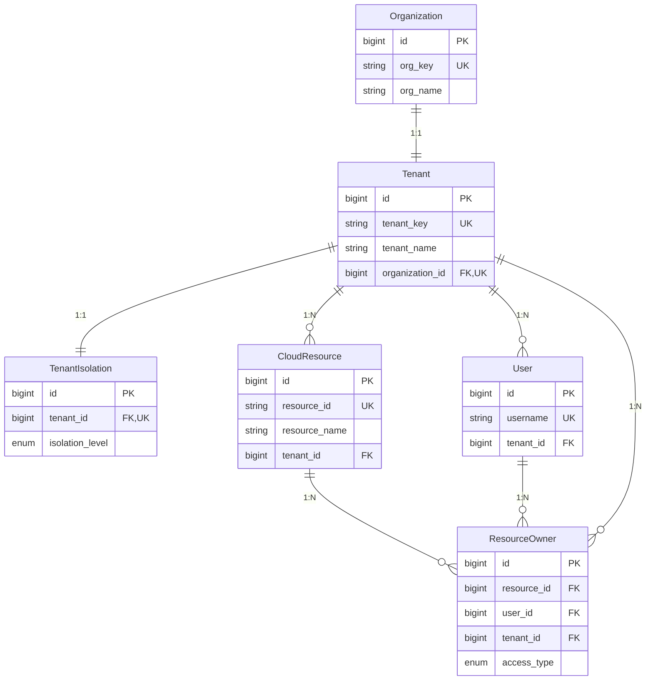
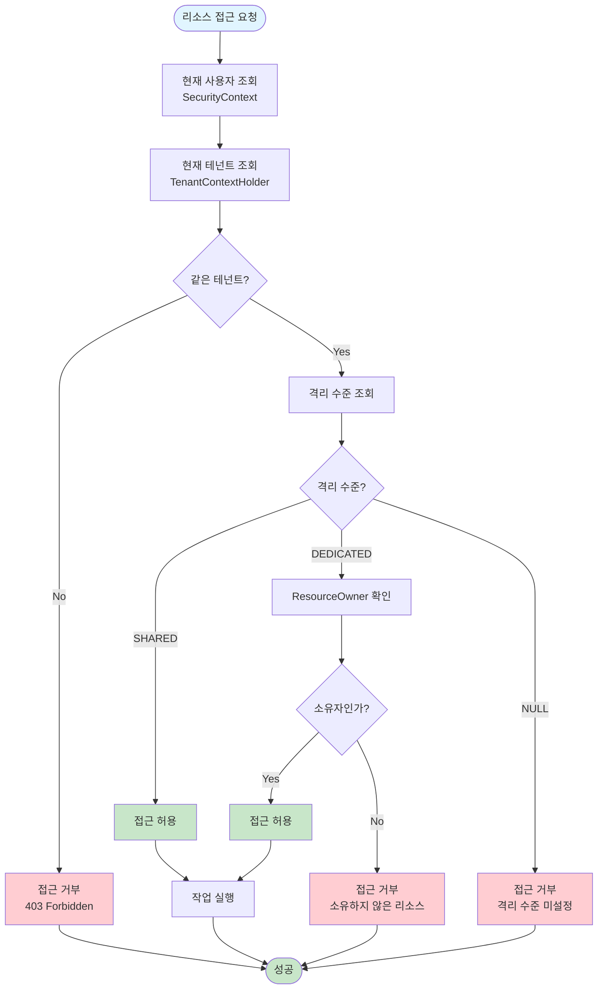
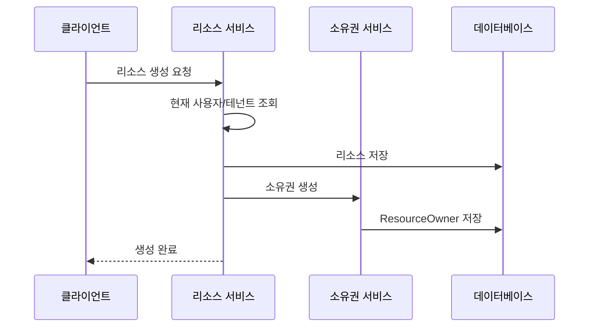
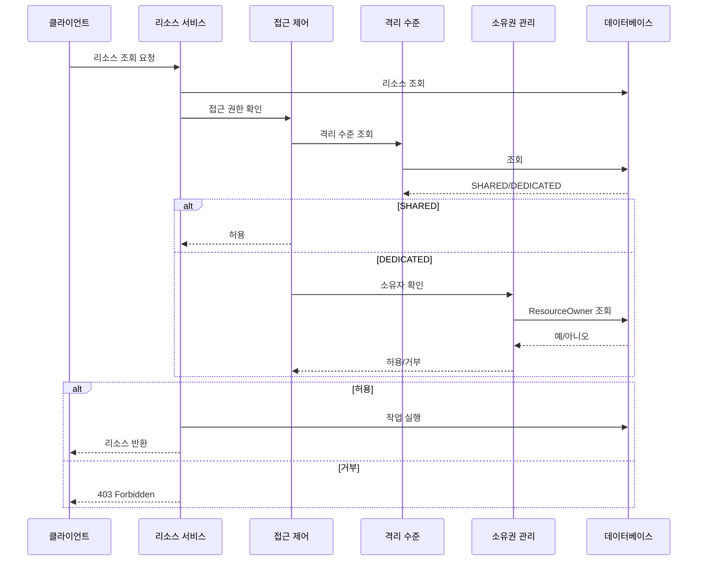

# 테넌트 격리 수준 정책 구현 문서

## 목차
1. [개요](#개요)
2. [구현 요구사항](#구현-요구사항)
3. [엔티티 관계 구조](#엔티티-관계-구조)
4. [데이터 모델](#데이터-모델)
5. [서비스 레이어](#서비스-레이어)
6. [접근 제어 로직](#접근-제어-로직)
7. [시퀀스 다이어그램](#시퀀스-다이어그램)
8. [추가 고려사항](#추가-고려사항)
9. [개선사항](#개선사항)

---

## 개요

### 목적
멀티 테넌트 환경에서 조직(테넌트) 단위로 리소스 접근 권한을 제어하기 위한 격리 수준 정책을 구현합니다.

### 핵심 개념
- **조직 = 테넌트**: 조직과 테넌트는 동일한 개념으로 사용
- **Worker**: 조직에 속한 사용자 (User)
- **리소스**: 클라우드 리소스 (CloudResource) - AWS, GCP 등 여러 클라우드 계정에서 생성
- **격리 수준**: SHARED, DEDICATED 두 가지 모드

### 격리 수준 정의

#### SHARED (공유 모드)
- 조직 내 모든 Worker가 모든 리소스에 접근 가능
- 리소스 공유 및 협업에 적합
- ResourceOwner 테이블 조회 불필요

#### DEDICATED (전용 모드)
- Worker는 본인이 생성한 리소스만 접근/관리 가능
- 리소스 소유권 기반 접근 제어
- ResourceOwner 테이블에서 소유권 확인 필수

---

## 구현 요구사항

### 기능 요구사항

#### FR-1: 리소스 생성 시 소유권 관리
- 리소스 생성 시 자동으로 ResourceOwner 레코드 생성
- 생성자(User)를 소유자로 등록
- 트랜잭션 일관성 보장 (리소스 생성 실패 시 소유권도 롤백)

#### FR-2: 격리 수준별 리소스 조회
- **SHARED 모드**: 테넌트의 모든 리소스 조회
- **DEDICATED 모드**: 사용자가 소유한 리소스만 조회
- 격리 수준 변경 시 기존 리소스 접근 영향 최소화

#### FR-3: 리소스 접근 권한 검증
- 리소스 조회/수정/삭제 시 접근 권한 검증
- 테넌트 일치 확인 필수
- 격리 수준에 따른 접근 제어 적용

#### FR-4: 격리 수준 관리
- 테넌트별 격리 수준 조회
- 격리 수준 설정/변경 기능
- 격리 수준 미설정 시 안전한 기본값 (접근 거부)

### 비기능 요구사항

#### NFR-1: 성능
- 격리 수준 조회는 캐싱 권장 (변경 빈도 낮음)
- ResourceOwner 조회 시 인덱스 활용 필수
- 목록 조회 시 JOIN 쿼리 최적화

#### NFR-2: 보안
- 접근 거부 시 상세 로그 기록 (보안 감사)
- 테넌트 간 데이터 접근 완전 차단
- 소유권 확인 실패 시 명확한 에러 메시지

#### NFR-3: 확장성
- 향후 공동 소유, 권한 레벨 추가 용이
- 리소스 소유권 이전 기능 확장 가능
- 격리 수준 추가 확장 가능

---

## 엔티티 관계 구조

### 전체 관계도



### 관계 상세

#### 1. Organization → Tenant (1:1)
- 하나의 조직은 하나의 테넌트만 가질 수 있음
- 테넌트는 반드시 하나의 조직에 속함
- **조직 = 테넌트**: 조직과 테넌트는 동일한 개념

#### 2. Tenant → TenantIsolation (1:1)
- 테넌트당 하나의 격리 정책
- 격리 수준: SHARED, DEDICATED

#### 3. Tenant → User (1:N)
- 하나의 테넌트는 여러 사용자를 가질 수 있음
- 사용자는 반드시 하나의 테넌트에 속함

#### 4. Tenant → CloudResource (1:N)
- 하나의 테넌트는 여러 리소스를 가질 수 있음
- 리소스는 반드시 하나의 테넌트에 속함

#### 5. CloudResource ↔ User (M:N via ResourceOwner)
- 중간 테이블(ResourceOwner)을 통한 다대다 관계
- DEDICATED 모드에서 소유권 관리에 사용

---

## 데이터 모델

### 1. TenantIsolation (테넌트 격리)

```java
@Entity
@Table(name = "tenant_isolation")
public class TenantIsolation extends BaseEntity {
    @OneToOne(fetch = FetchType.LAZY)
    @JoinColumn(name = "tenant_id", nullable = false)
    private Tenant tenant;
    
    @Enumerated(EnumType.STRING)
    @Column(name = "isolation_level")
    private IsolationLevel isolationLevel;  // SHARED, DEDICATED
    
    // 기타 격리 관련 필드들...
}
```

**주요 필드:**
- `tenant`: 테넌트 (1:1 관계)
- `isolationLevel`: 격리 수준 (SHARED, DEDICATED)

**인덱스:**
- `idx_tenant_isolation_tenant`: tenant_id (Unique)

### 2. ResourceOwner (리소스 소유자)

```java
@Entity
@Table(name = "resource_owners",
       uniqueConstraints = @UniqueConstraint(
           name = "uk_resource_user_deleted",
           columnNames = {"resource_id", "user_id", "is_deleted"}
       ))
public class ResourceOwner extends BaseEntity {
    @ManyToOne(fetch = FetchType.LAZY)
    @JoinColumn(name = "resource_id", nullable = false)
    private CloudResource resource;
    
    @ManyToOne(fetch = FetchType.LAZY)
    @JoinColumn(name = "user_id", nullable = false)
    private User user;
    
    @ManyToOne(fetch = FetchType.LAZY)
    @JoinColumn(name = "tenant_id", nullable = false)
    private Tenant tenant;
    
    @Enumerated(EnumType.STRING)
    @Column(name = "access_type", nullable = false)
    private AccessType accessType = AccessType.OWNER;
}
```

**주요 필드:**
- `resource`: 리소스
- `user`: 소유자 (Worker)
- `tenant`: 테넌트 (조직)
- `accessType`: 접근 타입 (OWNER, SHARED, READ_ONLY)

**제약조건:**
- `(resource_id, user_id, is_deleted)` 조합은 유일

**인덱스:**
- `idx_resource_owner_user_tenant`: (user_id, tenant_id, is_deleted)
- `idx_resource_owner_resource_tenant`: (resource_id, tenant_id, is_deleted)

### 3. CloudResource (클라우드 리소스)

```java
@Entity
@Table(name = "cloud_resources")
public class CloudResource extends BaseEntity {
    @ManyToOne(fetch = FetchType.LAZY)
    @JoinColumn(name = "tenant_id")
    private Tenant tenant;
    
    // 기타 리소스 필드들...
}
```

**주요 필드:**
- `tenant`: 테넌트 (조직)

### 4. User (사용자)

```java
@Entity
@Table(name = "users")
public class User extends BaseEntity {
    @ManyToOne(fetch = FetchType.LAZY)
    @JoinColumn(name = "tenant_id")
    private Tenant tenant;
    
    // 기타 사용자 필드들...
}
```

**주요 필드:**
- `tenant`: 테넌트 (조직)

---

## 서비스 레이어

### 1. TenantIsolationService

**역할**: 테넌트 격리 수준 관리

**주요 메서드:**

```java
/**
 * 테넌트의 격리 수준 조회
 */
public IsolationLevel getIsolationLevel(Tenant tenant)

/**
 * 테넌트의 격리 수준 설정
 */
@Transactional
public TenantIsolation setIsolationLevel(Tenant tenant, IsolationLevel level)

/**
 * 테넌트의 격리 정보 조회
 */
public Optional<TenantIsolation> getTenantIsolation(Tenant tenant)
```

**의존성:**
- `TenantIsolationRepository`

### 2. ResourceOwnerService

**역할**: 리소스 소유권 관리

**주요 메서드:**

```java
/**
 * 리소스 소유권 생성
 */
@Transactional
public void createResourceOwnership(CloudResource resource, User owner)

/**
 * 사용자가 소유한 리소스 목록 조회
 */
public List<CloudResource> getOwnedResources(User user, Tenant tenant)

/**
 * 리소스 소유권 확인
 */
public boolean isResourceOwner(User user, CloudResource resource)

/**
 * 리소스 소유권 삭제 (Soft Delete)
 */
@Transactional
public void deleteResourceOwnership(CloudResource resource, User user)
```

**의존성:**
- `ResourceOwnerRepository`

### 3. ResourceAccessControlService

**역할**: 리소스 접근 권한 검증

**주요 메서드:**

```java
/**
 * 리소스 접근 권한 검증
 */
public boolean canAccessResource(User user, CloudResource resource)

/**
 * 접근 가능한 리소스만 필터링
 */
public List<CloudResource> filterAccessibleResources(User user, List<CloudResource> resources)
```

**접근 제어 로직:**
1. 테넌트 일치 확인
2. 격리 수준 조회
3. SHARED → 접근 허용
4. DEDICATED → ResourceOwner 테이블에서 소유권 확인

**의존성:**
- `TenantIsolationService`
- `ResourceOwnerService`

### 4. CloudResourceService

**역할**: 리소스 CRUD 및 접근 제어 통합

**주요 메서드:**

```java
/**
 * 리소스 생성 (소유권 자동 등록)
 */
@Transactional
public CloudResource createResource(CloudResource resource)

/**
 * 사용자가 접근 가능한 리소스 목록 조회
 */
public List<CloudResource> getAccessibleResources()

/**
 * 리소스 조회 (접근 권한 검증)
 */
public CloudResource getResource(Long resourceId)

/**
 * 리소스 수정 (접근 권한 검증)
 */
@Transactional
public CloudResource updateResource(Long resourceId, CloudResource resource)

/**
 * 리소스 삭제 (접근 권한 검증)
 */
@Transactional
public void deleteResource(Long resourceId)
```

**의존성:**
- `CloudResourceRepository`
- `ResourceOwnerService`
- `ResourceAccessControlService`
- `TenantIsolationService`
- `UserService`

---

## 접근 제어 로직

### 전체 흐름



### 상세 로직

#### 1단계: 테넌트 일치 확인
```java
if (!isSameTenant(user.getTenant(), resource.getTenant())) {
    return false;  // 접근 거부
}
```

#### 2단계: 격리 수준 조회
```java
IsolationLevel level = tenantIsolationService.getIsolationLevel(resource.getTenant());
```

#### 3단계: 격리 수준별 접근 제어

**SHARED 모드:**
```java
if (level == IsolationLevel.SHARED) {
    return true;  // 테넌트 내 모든 사용자 접근 가능
}
```

**DEDICATED 모드:**
```java
if (level == IsolationLevel.DEDICATED) {
    return resourceOwnerService.isResourceOwner(user, resource);
}
```

### 접근 제어 적용 시점

| 작업 | 접근 제어 적용 | 비고 |
|------|--------------|------|
| 리소스 생성 | ❌ | 생성자는 자동으로 소유자 등록 |
| 리소스 조회 | ✅ | 단건/목록 모두 적용 |
| 리소스 수정 | ✅ | 접근 권한 검증 후 수정 |
| 리소스 삭제 | ✅ | 접근 권한 검증 후 삭제 |

---

## 시퀀스 다이어그램

### 리소스 생성 시퀀스



### 리소스 조회 시퀀스 (SHARED vs DEDICATED)



---

## 추가 고려사항

### 1. 기존 리소스 마이그레이션

**문제:**
- `owner`가 null인 기존 리소스 처리 방안 필요

**해결 방안:**

**옵션 1: SHARED 모드로만 접근 허용**
```java
// 격리 수준이 DEDICATED인데 ResourceOwner가 없는 경우
if (level == DEDICATED && !hasOwner) {
    // SHARED 모드로 간주하여 접근 허용
    return true;
}
```

**옵션 2: 마이그레이션 스크립트**
```java
@Transactional
public void migrateExistingResources() {
    List<CloudResource> resources = cloudResourceRepository.findAll();
    for (CloudResource resource : resources) {
        if (resource.getCreatedBy() != null) {
            User owner = userRepository.findByUsername(resource.getCreatedBy())
                .orElse(null);
            if (owner != null && !resourceOwnerService.isResourceOwner(owner, resource)) {
                resourceOwnerService.createResourceOwnership(resource, owner);
            }
        }
    }
}
```

**권장:** 옵션 2 (마이그레이션 스크립트) - 데이터 일관성 보장

### 2. 격리 수준 변경 시 영향

**시나리오 1: SHARED → DEDICATED**
- 기존 리소스 접근 제한 발생
- 모든 사용자가 접근하던 리소스가 소유자만 접근 가능
- **대응 방안**: 변경 전 사용자에게 공지, 마이그레이션 스크립트 실행

**시나리오 2: DEDICATED → SHARED**
- 모든 리소스 접근 허용
- ResourceOwner 테이블은 유지 (이력 보존)
- **대응 방안**: 즉시 적용 가능

**권장:**
- 격리 수준 변경 시 이벤트 발행
- 변경 전 검증 로직 추가
- 변경 이력 기록

### 3. 관리자 권한

**요구사항:**
- 관리자(Admin)는 모든 리소스 접근 가능 여부

**구현 방안:**

```java
public boolean canAccessResource(User user, CloudResource resource) {
    // 관리자 권한 확인
    if (user.hasRole("ADMIN") || user.hasPermission("RESOURCE_ADMIN_ACCESS")) {
        return true;
    }
    
    // 일반 접근 제어 로직...
}
```

**고려사항:**
- 관리자 권한은 테넌트 단위로 제한할지, 전체 시스템 단위로 할지 결정 필요
- 감사 로그에 관리자 접근 기록 필수

### 4. 리소스 소유권 이전

**요구사항:**
- 리소스 소유권을 다른 사용자에게 이전

**구현 방안:**

```java
@Transactional
public void transferResourceOwnership(CloudResource resource, User fromUser, User toUser) {
    // 1. 현재 소유권 확인
    if (!isResourceOwner(fromUser, resource)) {
        throw new AuthorizationException("소유권 이전 권한이 없습니다");
    }
    
    // 2. 기존 소유권 삭제 (Soft Delete)
    deleteResourceOwnership(resource, fromUser);
    
    // 3. 새로운 소유권 생성
    createResourceOwnership(resource, toUser);
    
    // 4. 이력 기록 (선택)
    recordOwnershipTransfer(resource, fromUser, toUser);
}
```

### 5. 공동 소유 (향후 확장)

**요구사항:**
- 여러 사용자가 하나의 리소스를 공동 소유

**구현 방안:**
- ResourceOwner 테이블에 여러 레코드 생성
- `accessType`을 통해 소유자/공유자 구분
- 접근 권한 검증 시 `accessType` 확인

```java
// 공동 소유자도 접근 가능
boolean canAccess = resourceOwnerRepository.existsByResourceAndUserAndAccessTypeIn(
    resource, user, List.of(AccessType.OWNER, AccessType.SHARED));
```

### 6. 성능 최적화

#### 캐싱 전략

**격리 수준 캐싱:**
```java
@Cacheable(value = "tenantIsolation", key = "#tenant.id")
public IsolationLevel getIsolationLevel(Tenant tenant) {
    // ...
}
```

**캐시 무효화:**
```java
@CacheEvict(value = "tenantIsolation", key = "#tenant.id")
@Transactional
public TenantIsolation setIsolationLevel(Tenant tenant, IsolationLevel level) {
    // ...
}
```

#### 쿼리 최적화

**인덱스 활용:**
- `(user_id, tenant_id, is_deleted)` 복합 인덱스
- `(resource_id, tenant_id, is_deleted)` 복합 인덱스

**JOIN 최적화 (Fetch Join):**
```java
@Query("SELECT DISTINCT ro.resource FROM ResourceOwner ro " +
       "LEFT JOIN FETCH ro.resource.provider " +
       "LEFT JOIN FETCH ro.resource.region " +
       "LEFT JOIN FETCH ro.resource.service " +
       "LEFT JOIN FETCH ro.resource.tenant " +
       "WHERE ro.user = :user AND ro.tenant = :tenant AND ro.isDeleted = false " +
       "AND ro.resource.isDeleted = false")
List<CloudResource> findResourcesByOwner(@Param("user") User user, 
                                        @Param("tenant") Tenant tenant);
```

**배치 조회 최적화 (N+1 문제 해결):**

**문제점:**
- 기존 구현: 리소스 목록 필터링 시 각 리소스마다 개별 쿼리 실행 (N+1 문제)
- 100개 리소스 조회 시 101번의 쿼리 실행 (1번 목록 조회 + 100번 소유권 확인)

**해결 방안:**
```java
// 1. 배치 소유권 확인 메서드 추가
@Query("SELECT ro.resource.id FROM ResourceOwner ro " +
       "WHERE ro.user = :user " +
       "AND ro.resource.id IN :resourceIds " +
       "AND ro.tenant = :tenant " +
       "AND ro.isDeleted = false")
List<Long> findOwnedResourceIds(@Param("user") User user,
                               @Param("resourceIds") List<Long> resourceIds,
                               @Param("tenant") Tenant tenant);

// 2. 필터링 시 배치 조회 사용
public List<CloudResource> filterAccessibleResources(User user, List<CloudResource> resources) {
    // 리소스 ID 목록 추출
    List<Long> resourceIds = resources.stream()
            .map(CloudResource::getId)
            .collect(Collectors.toList());
    
    // 배치로 소유한 리소스 ID 조회 (한 번의 쿼리)
    List<Long> ownedResourceIds = resourceOwnerService.getOwnedResourceIdsBatch(
            user, resourceIds, tenant);
    
    // 메모리에서 필터링
    Set<Long> ownedResourceIdSet = new HashSet<>(ownedResourceIds);
    return resources.stream()
            .filter(resource -> ownedResourceIdSet.contains(resource.getId()))
            .collect(Collectors.toList());
}
```

**성능 개선 효과:**
- **이전**: 100개 리소스 조회 시 101번 쿼리 실행
- **개선 후**: 100개 리소스 조회 시 2번 쿼리 실행 (1번 목록 조회 + 1번 배치 소유권 확인)
- **쿼리 수 감소**: 약 99% 감소 (101 → 2)

### 7. 트랜잭션 관리

**리소스 생성 시:**
```java
@Transactional
public CloudResource createResource(CloudResource resource) {
    // 1. 리소스 저장
    CloudResource saved = cloudResourceRepository.save(resource);
    
    // 2. 소유권 등록 (같은 트랜잭션)
    resourceOwnerService.createResourceOwnership(saved, currentUser);
    
    return saved;
}
```

**롤백 시나리오:**
- 리소스 저장 실패 → 소유권도 롤백
- 소유권 저장 실패 → 리소스도 롤백

### 8. 에러 처리

**기존 프로젝트의 에러 처리 로직 활용:**

프로젝트는 이미 표준화된 예외 처리 구조를 가지고 있습니다:
- `BusinessException`: 모든 비즈니스 예외의 최상위 클래스
- `ResourceNotFoundException`: 리소스를 찾을 수 없을 때 (404)
- `AuthorizationException`: 권한이 없을 때 (403)
- `GlobalExceptionHandler`: 전역 예외 처리 및 ApiResponse 변환

**접근 거부 시:**
```java
// ✅ 기존 AuthorizationException 활용
if (!accessControlService.canAccessResource(user, resource)) {
    throw new AuthorizationException(
        user.getId(), 
        "CloudResource", 
        "조회"
    );
}
```

**리소스 조회 실패 시:**
```java
// ✅ 기존 ResourceNotFoundException + CloudErrorCode 활용
CloudResource resource = cloudResourceRepository.findById(resourceId)
    .orElseThrow(() -> new ResourceNotFoundException(CloudErrorCode.CLOUD_RESOURCE_NOT_FOUND));
```

**에러 코드 활용:**
```java
// CloudErrorCode (4000-4999 범위)
CLOUD_RESOURCE_NOT_FOUND(HttpStatus.NOT_FOUND, 4009, "클라우드 리소스를 찾을 수 없습니다.")

// CommonErrorCode (공통 에러)
FORBIDDEN(HttpStatus.FORBIDDEN, 403, "접근 권한이 없습니다.")
NOT_FOUND(HttpStatus.NOT_FOUND, 404, "리소스를 찾을 수 없습니다.")
```

**에러 메시지:**
- 구체적인 이유 제공 (테넌트 불일치, 소유권 없음 등)
- 보안을 위해 과도한 정보 노출 방지
- `GlobalExceptionHandler`가 자동으로 `ApiResponse` 형식으로 변환

### 9. 로깅 및 감사

**기존 프로젝트의 감사 로깅 어노테이션 활용:**

프로젝트는 이미 표준화된 감사 로깅 어노테이션을 제공합니다:
- `@AuditController`: 클래스 레벨 감사 로깅
- `@AuditRequired`: 메서드 레벨 감사 로깅
- 자동으로 JSON 형식의 감사 로그 생성

**컨트롤러에 감사 로깅 적용 예시:**
```java
@RestController
@RequestMapping("/api/v1/cloud-resources")
@Slf4j
@AuditController(
    resourceType = AuditResourceType.CLOUD_RESOURCE,
    defaultSeverity = AuditSeverity.MEDIUM,
    defaultIncludeRequestData = true,
    targetHttpMethods = {"POST", "PUT", "PATCH", "DELETE"}
)
public class CloudResourceController {
    
    @PostMapping
    public ResponseEntity<ApiResponse<CloudResource>> createResource(
            @Valid @RequestBody CreateCloudResourceRequest request) {
        // 자동으로 감사 로깅 적용됨
        // - action: "createResource"
        // - resourceType: CLOUD_RESOURCE
        // - severity: MEDIUM
        // - requestData 포함
    }
    
    @PutMapping("/{id}")
    @AuditRequired(
        action = "updateCloudResource",
        resourceType = AuditResourceType.CLOUD_RESOURCE,
        severity = AuditSeverity.HIGH,
        includeRequestData = true,
        includeResponseData = true,
        description = "클라우드 리소스 수정"
    )
    public ResponseEntity<ApiResponse<CloudResource>> updateResource(
            @PathVariable Long id,
            @Valid @RequestBody UpdateCloudResourceRequest request) {
        // 메서드 레벨 설정이 클래스 레벨보다 우선
    }
}
```

**서비스 레이어의 애플리케이션 로깅:**
```java
// ✅ 기존 @Slf4j 활용
@Slf4j
@Service
public class ResourceAccessControlService {
    
    public boolean canAccessResource(User user, CloudResource resource) {
        // 접근 거부 로그 (WARN 레벨)
        log.warn("[ResourceAccessControlService] canAccessResource - denied: DEDICATED mode (not owner) - userId={}, resourceId={}",
            user.getId(), resource.getId());
        
        // 접근 허용 로그 (DEBUG 레벨)
        log.debug("[ResourceAccessControlService] canAccessResource - granted: SHARED mode - userId={}, resourceId={}",
            user.getId(), resource.getId());
    }
}
```

**감사 로그 자동 생성:**
- 리소스 생성/수정/삭제 시 자동으로 감사 로그 생성
- 격리 수준 변경 시 감사 로그 생성 (컨트롤러에 `@AuditRequired` 적용)
- 소유권 이전 시 감사 로그 생성 (컨트롤러에 `@AuditRequired` 적용)

**감사 로그 저장 위치:**
- 별도의 감사 로그 파일 (`audit.log`)
- 구조화된 JSON 형식
- `AuditLog` 엔티티를 통한 DB 저장 (선택적)

---

## 개선사항

### 1. 단기 개선사항

#### 1.1 격리 수준 기본값 설정
**현재:** 격리 수준 미설정 시 접근 거부 (안전한 기본값)
**개선:** 테넌트 생성 시 기본 격리 수준 자동 설정

```java
@Transactional
public Tenant createTenant(Tenant tenant) {
    Tenant saved = tenantRepository.save(tenant);
    
    // 기본 격리 수준 설정 (SHARED)
    tenantIsolationService.setIsolationLevel(saved, IsolationLevel.SHARED);
    
    return saved;
}
```

#### 1.2 격리 수준 변경 검증
**개선:** 격리 수준 변경 전 영향도 분석

```java
@Transactional
public TenantIsolation setIsolationLevel(Tenant tenant, IsolationLevel newLevel) {
    IsolationLevel currentLevel = getIsolationLevel(tenant);
    
    if (currentLevel != null && currentLevel != newLevel) {
        // 영향도 분석
        IsolationLevelChangeImpact impact = analyzeImpact(tenant, currentLevel, newLevel);
        
        // 경고 로그
        log.warn("격리 수준 변경 - tenantId={}, {} -> {}, 영향받는 리소스: {}",
            tenant.getId(), currentLevel, newLevel, impact.getAffectedResourceCount());
    }
    
    // 격리 수준 변경
    // ...
}
```

#### 1.3 배치 작업 최적화
**개선:** 목록 조회 시 N+1 문제 해결

```java
// 현재: 각 리소스마다 소유권 확인
// 개선: 한 번의 쿼리로 모든 소유권 조회

@Query("SELECT ro FROM ResourceOwner ro " +
       "WHERE ro.user = :user AND ro.tenant = :tenant AND ro.isDeleted = false")
List<ResourceOwner> findByUserAndTenant(@Param("user") User user, 
                                        @Param("tenant") Tenant tenant);

// 리소스 ID 목록으로 일괄 조회
Set<Long> ownedResourceIds = resourceOwners.stream()
    .map(ro -> ro.getResource().getId())
    .collect(Collectors.toSet());
```

### 2. 중기 개선사항

#### 2.1 리소스 공유 기능
**요구사항:** DEDICATED 모드에서도 특정 리소스를 다른 사용자와 공유

**구현:**
```java
@Transactional
public void shareResource(CloudResource resource, User owner, User sharedUser) {
    // 소유권 확인
    if (!isResourceOwner(owner, resource)) {
        throw new AuthorizationException("리소스 공유 권한이 없습니다");
    }
    
    // 공유 소유권 생성
    ResourceOwner sharedOwnership = ResourceOwner.builder()
        .resource(resource)
        .user(sharedUser)
        .tenant(resource.getTenant())
        .accessType(AccessType.SHARED)  // 공유 접근
        .build();
    
    resourceOwnerRepository.save(sharedOwnership);
}
```

#### 2.2 접근 권한 레벨 세분화
**요구사항:** 읽기 전용, 읽기/쓰기 등 세분화된 권한

**구현:**
```java
public enum AccessType {
    OWNER,      // 소유자 (모든 권한)
    READ_WRITE, // 읽기/쓰기
    READ_ONLY,  // 읽기 전용
    SHARED      // 공유 접근
}

// 접근 권한 검증 시 작업 타입 확인
public boolean canAccessResource(User user, CloudResource resource, OperationType operation) {
    if (operation == OperationType.READ) {
        return hasAccessType(user, resource, 
            AccessType.OWNER, AccessType.READ_WRITE, AccessType.READ_ONLY, AccessType.SHARED);
    } else if (operation == OperationType.WRITE || operation == OperationType.DELETE) {
        return hasAccessType(user, resource, AccessType.OWNER, AccessType.READ_WRITE);
    }
    return false;
}
```

#### 2.3 리소스 그룹 관리
**요구사항:** 여러 리소스를 그룹으로 묶어서 관리

**구현:**
```java
@Entity
@Table(name = "resource_groups")
public class ResourceGroup extends BaseEntity {
    @ManyToOne(fetch = FetchType.LAZY)
    @JoinColumn(name = "tenant_id", nullable = false)
    private Tenant tenant;
    
    @ManyToMany
    @JoinTable(name = "resource_group_members",
               joinColumns = @JoinColumn(name = "group_id"),
               inverseJoinColumns = @JoinColumn(name = "resource_id"))
    private List<CloudResource> resources;
    
    @ManyToOne(fetch = FetchType.LAZY)
    @JoinColumn(name = "owner_id", nullable = false)
    private User owner;
}
```

### 3. 장기 개선사항

#### 3.1 동적 격리 수준
**요구사항:** 리소스 타입별로 다른 격리 수준 적용

**구현:**
```java
@Entity
@Table(name = "resource_type_isolation")
public class ResourceTypeIsolation extends BaseEntity {
    @ManyToOne(fetch = FetchType.LAZY)
    @JoinColumn(name = "tenant_id", nullable = false)
    private Tenant tenant;
    
    @Enumerated(EnumType.STRING)
    @Column(name = "resource_type", nullable = false)
    private CloudResource.ResourceType resourceType;
    
    @Enumerated(EnumType.STRING)
    @Column(name = "isolation_level", nullable = false)
    private IsolationLevel isolationLevel;
}
```

#### 3.2 시간 기반 접근 제어
**요구사항:** 특정 시간대에만 리소스 접근 허용

**구현:**
```java
@Entity
@Table(name = "resource_access_schedules")
public class ResourceAccessSchedule extends BaseEntity {
    @ManyToOne(fetch = FetchType.LAZY)
    @JoinColumn(name = "resource_id", nullable = false)
    private CloudResource resource;
    
    @ManyToOne(fetch = FetchType.LAZY)
    @JoinColumn(name = "user_id", nullable = false)
    private User user;
    
    @Column(name = "allowed_time_ranges", columnDefinition = "TEXT")
    private String allowedTimeRanges;  // JSON: [{"start": "09:00", "end": "18:00"}]
}
```

#### 3.3 리소스 접근 통계
**요구사항:** 리소스별 접근 통계 및 분석

**구현:**
```java
@Entity
@Table(name = "resource_access_logs")
public class ResourceAccessLog extends BaseEntity {
    @ManyToOne(fetch = FetchType.LAZY)
    @JoinColumn(name = "resource_id", nullable = false)
    private CloudResource resource;
    
    @ManyToOne(fetch = FetchType.LAZY)
    @JoinColumn(name = "user_id", nullable = false)
    private User user;
    
    @Enumerated(EnumType.STRING)
    @Column(name = "operation_type", nullable = false)
    private OperationType operationType;  // READ, WRITE, DELETE
    
    @Column(name = "access_time", nullable = false)
    private LocalDateTime accessTime;
    
    @Column(name = "ip_address")
    private String ipAddress;
}
```

#### 3.4 자동 리소스 정리
**요구사항:** 미사용 리소스 자동 정리

**구현:**
```java
@Scheduled(cron = "0 0 2 * * ?")  // 매일 새벽 2시
public void cleanupUnusedResources() {
    LocalDateTime threshold = LocalDateTime.now().minusMonths(6);
    
    List<CloudResource> unusedResources = cloudResourceRepository
        .findUnusedResources(threshold);
    
    for (CloudResource resource : unusedResources) {
        // 소유자에게 알림
        notificationService.notifyResourceOwner(resource, 
            "6개월 이상 사용되지 않은 리소스입니다. 삭제 예정일: " + 
            LocalDateTime.now().plusDays(30));
    }
}
```

### 4. 보안 강화

#### 4.1 접근 패턴 분석
**요구사항:** 비정상적인 접근 패턴 탐지

**구현:**
```java
public boolean detectAnomalousAccess(User user, CloudResource resource) {
    // 1. 시간대 분석 (비정상적인 시간대 접근)
    if (isUnusualTimeAccess(user, resource)) {
        return true;
    }
    
    // 2. 접근 빈도 분석 (과도한 접근 시도)
    if (isHighFrequencyAccess(user, resource)) {
        return true;
    }
    
    // 3. IP 주소 분석 (새로운 IP에서 접근)
    if (isNewIpAccess(user, resource)) {
        return true;
    }
    
    return false;
}
```

#### 4.2 2단계 인증 강화
**요구사항:** 민감한 리소스 접근 시 2FA 필수

**구현:**
```java
public boolean canAccessResource(User user, CloudResource resource) {
    // 일반 접근 제어 로직...
    
    // 민감한 리소스인 경우 2FA 확인
    if (isSensitiveResource(resource) && !user.isTwoFactorVerified()) {
        throw new TwoFactorRequiredException("민감한 리소스 접근을 위해 2FA 인증이 필요합니다");
    }
    
    return true;
}
```

### 5. 모니터링 및 알림

#### 5.1 접근 실패 모니터링
**구현:**
```java
@EventListener
public void handleAccessDenied(AccessDeniedEvent event) {
    // 접근 실패 횟수 증가
    accessFailureCounter.increment(event.getUserId(), event.getResourceId());
    
    // 임계값 초과 시 알림
    if (accessFailureCounter.getCount(event.getUserId()) > 10) {
        alertService.sendAlert("사용자 " + event.getUserId() + 
            "의 접근 실패 횟수가 임계값을 초과했습니다");
    }
}
```

#### 5.2 리소스 사용량 모니터링
**구현:**
```java
@Entity
@Table(name = "resource_usage_metrics")
public class ResourceUsageMetric extends BaseEntity {
    @ManyToOne(fetch = FetchType.LAZY)
    @JoinColumn(name = "resource_id", nullable = false)
    private CloudResource resource;
    
    @ManyToOne(fetch = FetchType.LAZY)
    @JoinColumn(name = "user_id", nullable = false)
    private User user;
    
    @Column(name = "access_count")
    private Long accessCount = 0L;
    
    @Column(name = "last_accessed_at")
    private LocalDateTime lastAccessedAt;
}
```

---

## 구현 체크리스트

### Phase 1: 기본 구현 ✅
- [x] ResourceOwner 엔티티 생성
- [x] ResourceOwnerRepository 생성
- [x] TenantIsolationRepository 생성
- [x] ResourceOwnerService 구현
- [x] ResourceAccessControlService 구현
- [x] TenantIsolationService 재작성
- [x] CloudResourceService 수정
- [x] Organization과 Tenant 관계를 1:1로 변경
- [x] OrganizationService 및 Repository 수정
- [x] 기존 감사 로깅 어노테이션 활용 (`@AuditController`, `@AuditRequired`)
- [x] 기존 에러 처리 로직 활용 (`BusinessException`, `ResourceNotFoundException`, `AuthorizationException`)

### Phase 2: 테스트 및 검증
- [ ] 단위 테스트 작성
- [ ] 통합 테스트 작성
- [ ] 성능 테스트
- [ ] 보안 테스트

### Phase 3: 마이그레이션
- [ ] 기존 리소스 마이그레이션 스크립트 작성
- [ ] 마이그레이션 테스트
- [ ] 프로덕션 배포 계획

### Phase 4: 모니터링 및 문서화
- [ ] 모니터링 대시보드 구성
- [ ] 운영 문서 작성
- [ ] 사용자 가이드 작성

---

## 참고 자료

- [접근 제어 흐름 설계 문서](./TENANT_ISOLATION_ACCESS_CONTROL_DESIGN.md)
- [도메인 아키텍처 문서](./DOMAIN_ARCHITECTURE.md)
- [테스트 가이드라인](./TESTING_GUIDELINES.md)

---

## 변경 이력

| 버전 | 날짜 | 변경 내용 | 작성자 |
|------|------|----------|--------|
| 1.0.0 | 2025-01-XX | 초기 문서 작성 | AgenticCP Team |

