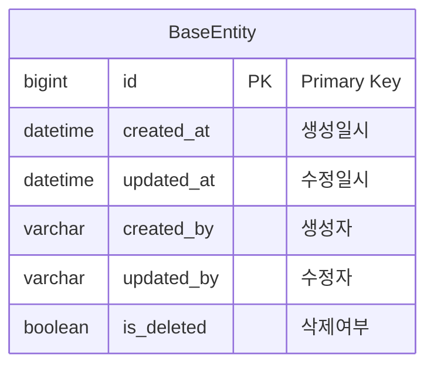
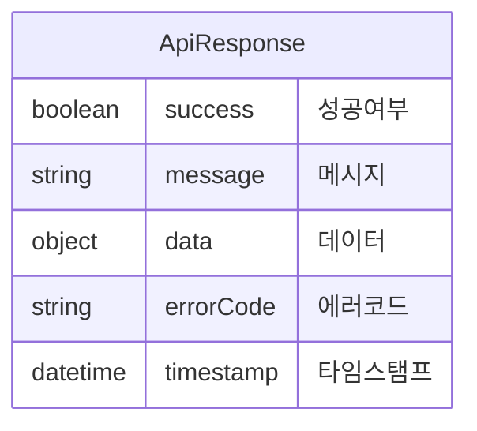
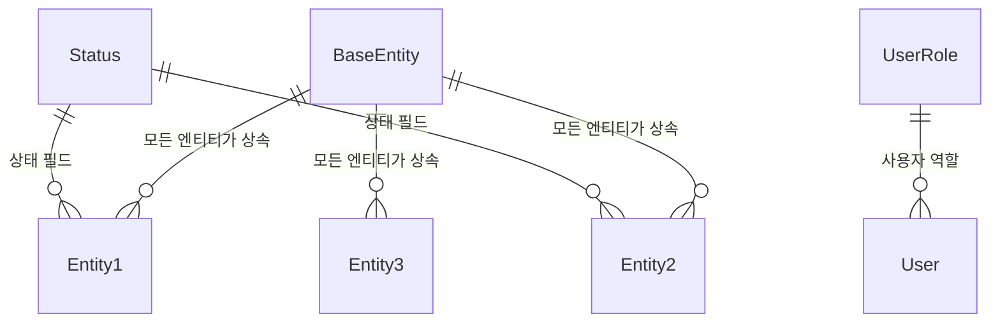

# 공통 엔티티 ERD

## BaseEntity
모든 엔티티의 기본 클래스로 공통 필드를 제공합니다.



## 공통 열거형 (Enums)

### Status
```mermaid
erDiagram
    Status {
        ACTIVE "활성"
        INACTIVE "비활성"
        PENDING "대기"
        SUSPENDED "일시정지"
        DELETED "삭제됨"
    }
```

### UserRole
```mermaid
erDiagram
    UserRole {
        SUPER_ADMIN "최고관리자"
        TENANT_ADMIN "테넌트관리자"
        CLOUD_ADMIN "클라우드관리자"
        DEVELOPER "개발자"
        VIEWER "조회자"
        AUDITOR "감사자"
    }
```

## 공통 DTO

### ApiResponse


## 공통 예외 클래스

### Exception Hierarchy
```mermaid
erDiagram
    Exception {
        BusinessException "비즈니스 예외"
        ResourceNotFoundException "리소스 없음 예외"
        ValidationException "검증 예외"
    }
    
    BusinessException ||--|| Exception : extends
    ResourceNotFoundException ||--|| BusinessException : extends
    ValidationException ||--|| BusinessException : extends
```

## 테이블 관계도



## 인덱스 전략

### 공통 인덱스
- `created_at`: 생성일시 조회용
- `updated_at`: 수정일시 조회용
- `is_deleted`: 삭제된 레코드 필터링용
- `created_by`: 생성자별 조회용
- `updated_by`: 수정자별 조회용

### 복합 인덱스
- `(tenant_id, is_deleted)`: 테넌트별 활성 레코드 조회
- `(created_at, is_deleted)`: 최근 생성된 활성 레코드 조회
- `(updated_at, is_deleted)`: 최근 수정된 활성 레코드 조회
