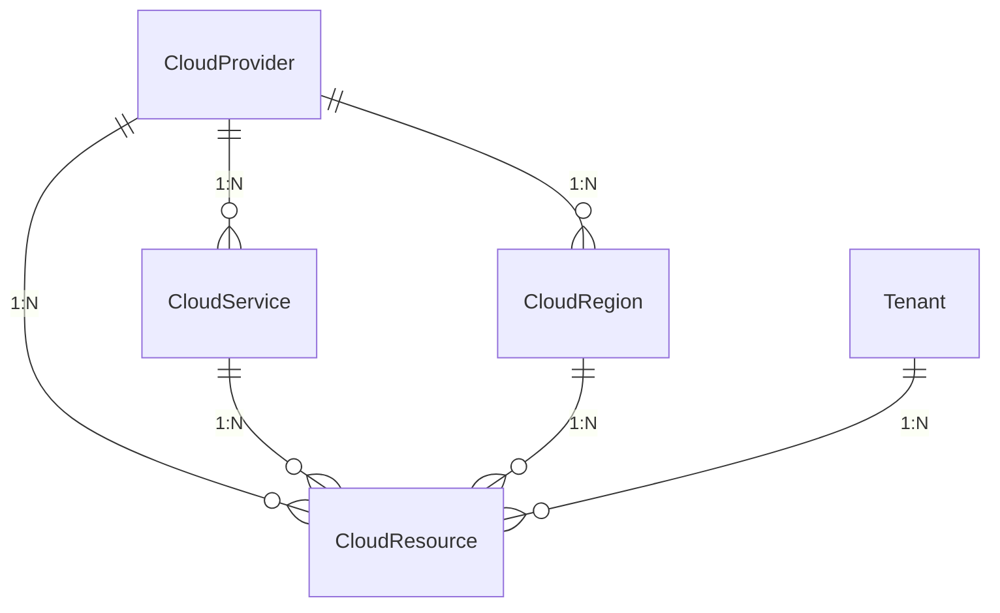
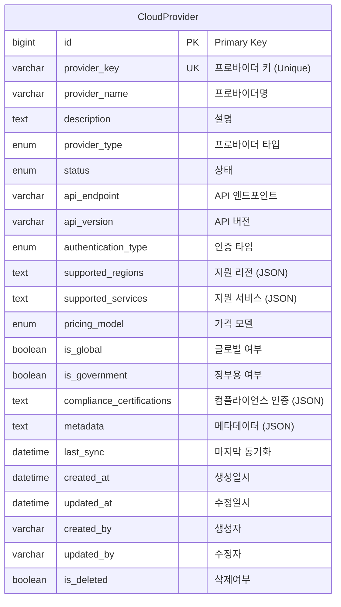
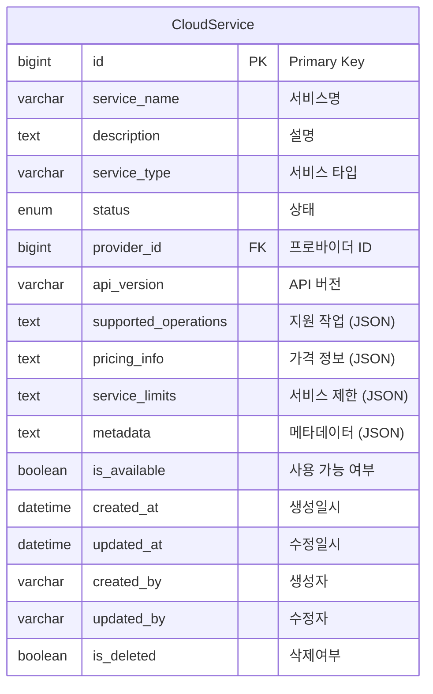
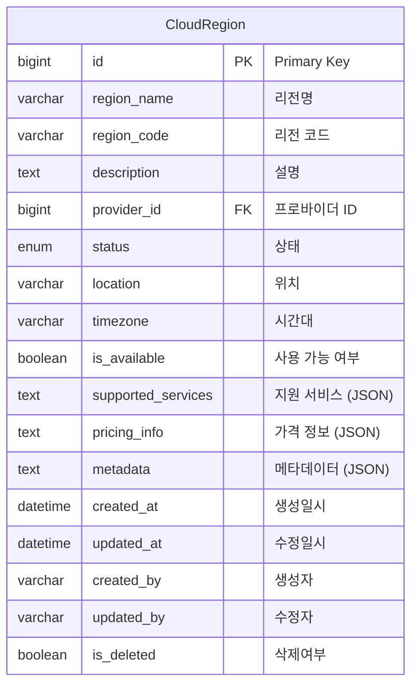
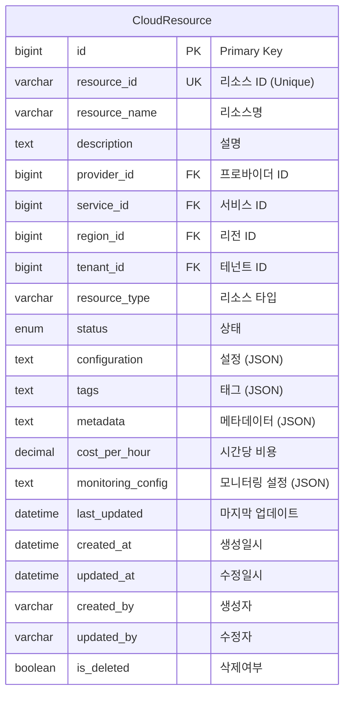

# Cloud Management Domain ERD

## 엔티티 관계도



## 주요 엔티티

### CloudProvider (클라우드 프로바이더)


### CloudService (클라우드 서비스)


### CloudRegion (클라우드 리전)


### CloudResource (클라우드 리소스)


## 열거형 (Enums)

### ProviderType
```mermaid
erDiagram
    ProviderType {
        AWS "Amazon Web Services"
        AZURE "Microsoft Azure"
        GCP "Google Cloud Platform"
        ALIBABA_CLOUD "Alibaba Cloud"
        IBM_CLOUD "IBM Cloud"
        ORACLE_CLOUD "Oracle Cloud"
        VMWARE "VMware"
        OPENSTACK "OpenStack"
        KUBERNETES "Kubernetes"
        DOCKER "Docker"
    }
```

### AuthenticationType
```mermaid
erDiagram
    AuthenticationType {
        API_KEY "API 키"
        OAUTH2 "OAuth 2.0"
        IAM_ROLE "IAM 역할"
        SERVICE_ACCOUNT "서비스 계정"
        CERTIFICATE "인증서"
        TOKEN "토큰"
    }
```

### PricingModel
```mermaid
erDiagram
    PricingModel {
        PAY_AS_YOU_GO "종량제"
        RESERVED_INSTANCE "예약 인스턴스"
        SPOT_INSTANCE "스팟 인스턴스"
        SAVINGS_PLANS "절약 플랜"
        COMMITTED_USE "커밋 사용"
        PREPAID "선불"
    }
```

## 인덱스 전략

### CloudProvider 테이블
- `idx_cloud_provider_key`: provider_key 컬럼 (Unique)
- `idx_cloud_provider_type`: provider_type 컬럼
- `idx_cloud_provider_status`: status 컬럼
- `idx_cloud_provider_global`: is_global 컬럼
- `idx_cloud_provider_government`: is_government 컬럼

### CloudService 테이블
- `idx_cloud_service_provider`: provider_id 컬럼
- `idx_cloud_service_type`: service_type 컬럼
- `idx_cloud_service_status`: status 컬럼
- `idx_cloud_service_available`: is_available 컬럼

### CloudRegion 테이블
- `idx_cloud_region_provider`: provider_id 컬럼
- `idx_cloud_region_code`: region_code 컬럼
- `idx_cloud_region_status`: status 컬럼
- `idx_cloud_region_available`: is_available 컬럼

### CloudResource 테이블
- `idx_cloud_resource_id`: resource_id 컬럼 (Unique)
- `idx_cloud_resource_provider`: provider_id 컬럼
- `idx_cloud_resource_service`: service_id 컬럼
- `idx_cloud_resource_region`: region_id 컬럼
- `idx_cloud_resource_tenant`: tenant_id 컬럼
- `idx_cloud_resource_type`: resource_type 컬럼
- `idx_cloud_resource_status`: status 컬럼

## 비즈니스 규칙

1. **프로바이더 관리**: 다양한 클라우드 프로바이더를 통합 관리
2. **서비스 추상화**: 프로바이더별 서비스를 통합된 인터페이스로 제공
3. **리전 지원**: 글로벌 리전별 리소스 관리
4. **테넌트 격리**: 테넌트별 리소스 격리 및 관리
5. **비용 추적**: 리소스별 비용 모니터링 및 관리
6. **상태 관리**: 리소스의 생명주기 상태 추적
7. **메타데이터**: 리소스별 상세 정보 및 설정 저장
8. **태그 관리**: 리소스 분류 및 관리를 위한 태그 시스템
