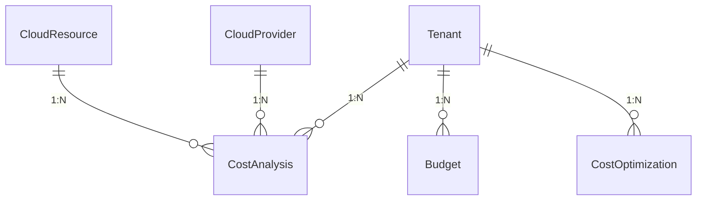
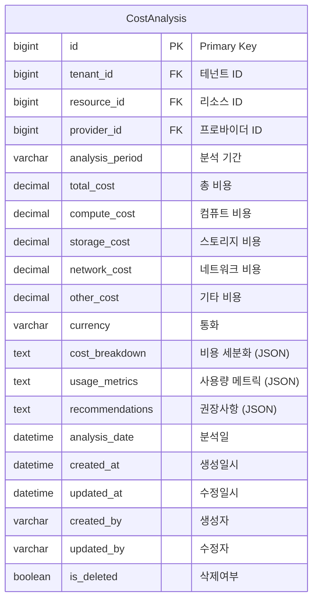
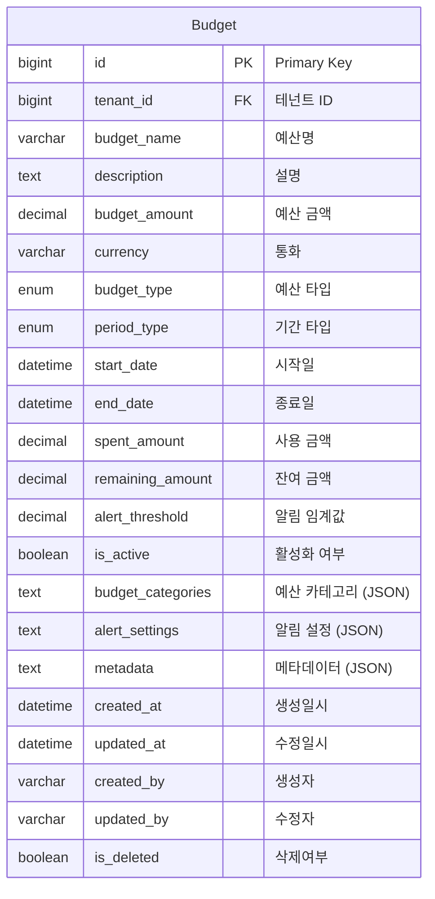
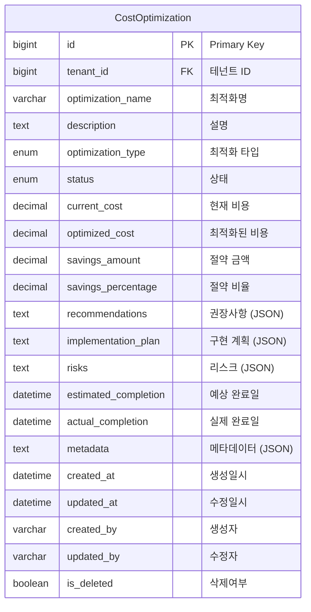

# Cost Management Domain ERD

## 엔티티 관계도



## 주요 엔티티

### CostAnalysis (비용 분석)


### Budget (예산)


### CostOptimization (비용 최적화)


## 열거형 (Enums)

### BudgetType
```mermaid
erDiagram
    BudgetType {
        MONTHLY "월간"
        QUARTERLY "분기별"
        YEARLY "연간"
        PROJECT "프로젝트별"
        DEPARTMENT "부서별"
        CUSTOM "사용자 정의"
    }
```

### PeriodType
```mermaid
erDiagram
    PeriodType {
        DAILY "일간"
        WEEKLY "주간"
        MONTHLY "월간"
        QUARTERLY "분기별"
        YEARLY "연간"
    }
```

### OptimizationType
```mermaid
erDiagram
    OptimizationType {
        RIGHT_SIZING "리사이징"
        RESERVED_INSTANCES "예약 인스턴스"
        SPOT_INSTANCES "스팟 인스턴스"
        AUTO_SCALING "자동 스케일링"
        STORAGE_OPTIMIZATION "스토리지 최적화"
        NETWORK_OPTIMIZATION "네트워크 최적화"
        LIFECYCLE_MANAGEMENT "생명주기 관리"
        CUSTOM "사용자 정의"
    }
```

### OptimizationStatus
```mermaid
erDiagram
    OptimizationStatus {
        PENDING "대기"
        IN_PROGRESS "진행중"
        COMPLETED "완료"
        FAILED "실패"
        CANCELLED "취소"
    }
```

## 인덱스 전략

### CostAnalysis 테이블
- `idx_cost_analysis_tenant`: tenant_id 컬럼
- `idx_cost_analysis_resource`: resource_id 컬럼
- `idx_cost_analysis_provider`: provider_id 컬럼
- `idx_cost_analysis_period`: analysis_period 컬럼
- `idx_cost_analysis_date`: analysis_date 컬럼
- `idx_cost_analysis_tenant_period`: (tenant_id, analysis_period) 복합

### Budget 테이블
- `idx_budget_tenant`: tenant_id 컬럼
- `idx_budget_type`: budget_type 컬럼
- `idx_budget_period`: (start_date, end_date) 복합
- `idx_budget_active`: is_active 컬럼
- `idx_budget_tenant_active`: (tenant_id, is_active) 복합

### CostOptimization 테이블
- `idx_cost_optimization_tenant`: tenant_id 컬럼
- `idx_cost_optimization_type`: optimization_type 컬럼
- `idx_cost_optimization_status`: status 컬럼
- `idx_cost_optimization_completion`: estimated_completion 컬럼

## 비즈니스 규칙

1. **비용 추적**: 리소스별 상세 비용 분석 및 추적
2. **예산 관리**: 테넌트별 예산 설정 및 모니터링
3. **최적화 제안**: 비용 절약을 위한 자동 최적화 제안
4. **알림 시스템**: 예산 초과 및 비용 급증 알림
5. **리포팅**: 다양한 관점의 비용 리포팅
6. **예측**: 미래 비용 예측 및 계획 수립
7. **카테고리 관리**: 비용 카테고리별 분석 및 관리
8. **통화 지원**: 다중 통화 지원 및 환율 적용
