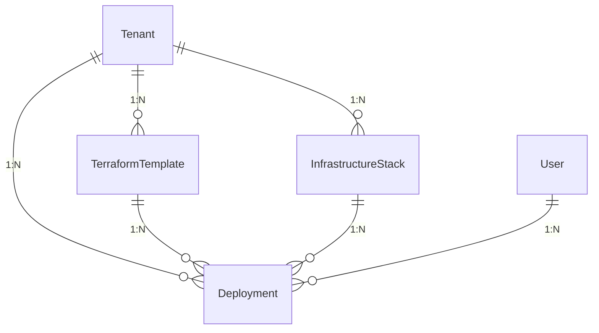
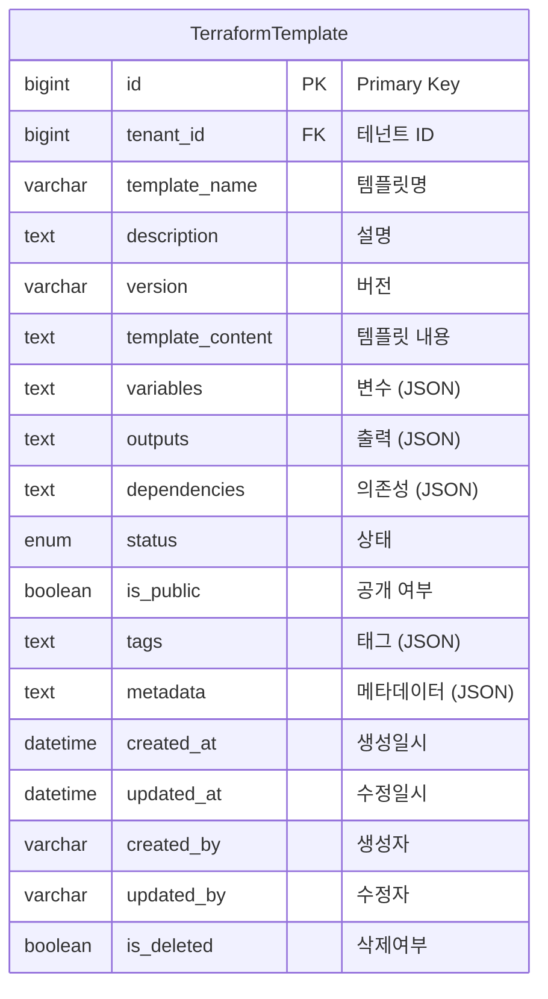
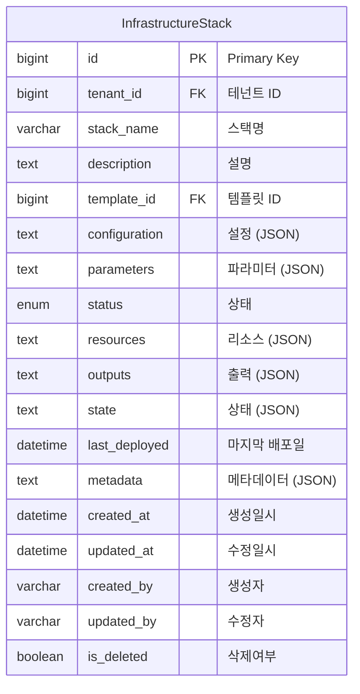
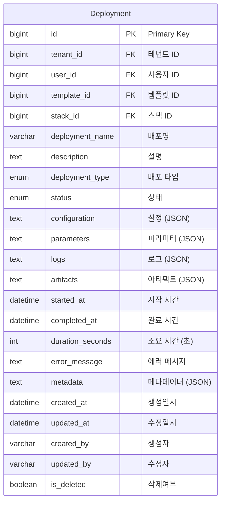
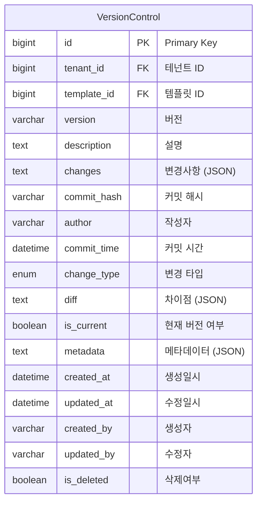

# Infrastructure as Code Domain ERD

## 엔티티 관계도



## 주요 엔티티

### TerraformTemplate (Terraform 템플릿)


### InfrastructureStack (인프라 스택)


### Deployment (배포)


### VersionControl (버전 관리)


## 열거형 (Enums)

### TemplateStatus
```mermaid
erDiagram
    TemplateStatus {
        DRAFT "초안"
        ACTIVE "활성"
        DEPRECATED "사용 중단"
        ARCHIVED "보관됨"
    }
```

### StackStatus
```mermaid
erDiagram
    StackStatus {
        PENDING "대기"
        CREATING "생성중"
        ACTIVE "활성"
        UPDATING "업데이트중"
        DELETING "삭제중"
        FAILED "실패"
        DELETED "삭제됨"
    }
```

### DeploymentType
```mermaid
erDiagram
    DeploymentType {
        CREATE "생성"
        UPDATE "업데이트"
        DESTROY "삭제"
        PLAN "계획"
        APPLY "적용"
        ROLLBACK "롤백"
    }
```

### DeploymentStatus
```mermaid
erDiagram
    DeploymentStatus {
        PENDING "대기"
        RUNNING "실행중"
        SUCCESS "성공"
        FAILED "실패"
        CANCELLED "취소"
        ROLLING_BACK "롤백중"
    }
```

### ChangeType
```mermaid
erDiagram
    ChangeType {
        ADD "추가"
        MODIFY "수정"
        DELETE "삭제"
        RENAME "이름변경"
        MOVE "이동"
    }
```

## 인덱스 전략

### TerraformTemplate 테이블
- `idx_terraform_template_tenant`: tenant_id 컬럼
- `idx_terraform_template_name`: template_name 컬럼
- `idx_terraform_template_status`: status 컬럼
- `idx_terraform_template_public`: is_public 컬럼
- `idx_terraform_template_tenant_status`: (tenant_id, status) 복합

### InfrastructureStack 테이블
- `idx_infrastructure_stack_tenant`: tenant_id 컬럼
- `idx_infrastructure_stack_name`: stack_name 컬럼
- `idx_infrastructure_stack_template`: template_id 컬럼
- `idx_infrastructure_stack_status`: status 컬럼
- `idx_infrastructure_stack_tenant_status`: (tenant_id, status) 복합

### Deployment 테이블
- `idx_deployment_tenant`: tenant_id 컬럼
- `idx_deployment_user`: user_id 컬럼
- `idx_deployment_template`: template_id 컬럼
- `idx_deployment_stack`: stack_id 컬럼
- `idx_deployment_status`: status 컬럼
- `idx_deployment_type`: deployment_type 컬럼
- `idx_deployment_started`: started_at 컬럼
- `idx_deployment_tenant_status`: (tenant_id, status) 복합

### VersionControl 테이블
- `idx_version_control_tenant`: tenant_id 컬럼
- `idx_version_control_template`: template_id 컬럼
- `idx_version_control_version`: version 컬럼
- `idx_version_control_current`: is_current 컬럼
- `idx_version_control_commit_time`: commit_time 컬럼

## 비즈니스 규칙

1. **템플릿 관리**: 재사용 가능한 인프라 템플릿 관리
2. **스택 관리**: 템플릿 기반 인프라 스택 생성 및 관리
3. **배포 관리**: 안전한 배포 프로세스 및 롤백 지원
4. **버전 관리**: 템플릿 및 스택의 버전 관리
5. **상태 추적**: 인프라 상태의 실시간 추적
6. **의존성 관리**: 리소스 간 의존성 관리
7. **변수 관리**: 환경별 변수 및 파라미터 관리
8. **권한 관리**: 테넌트별 인프라 접근 권한 제어
