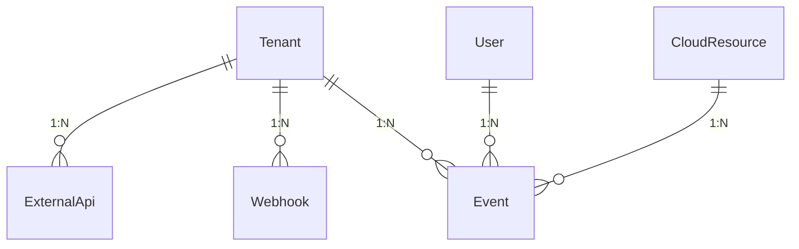
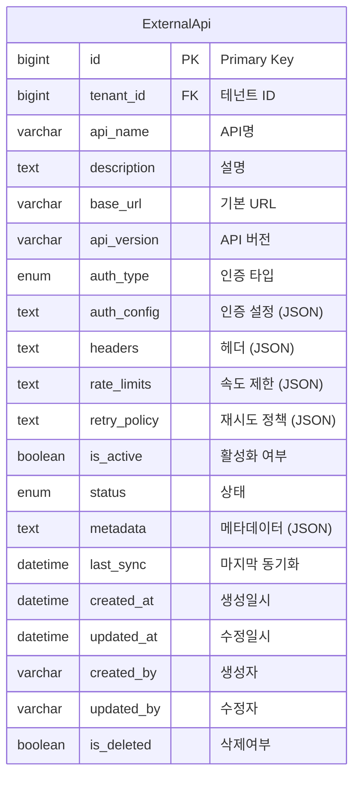
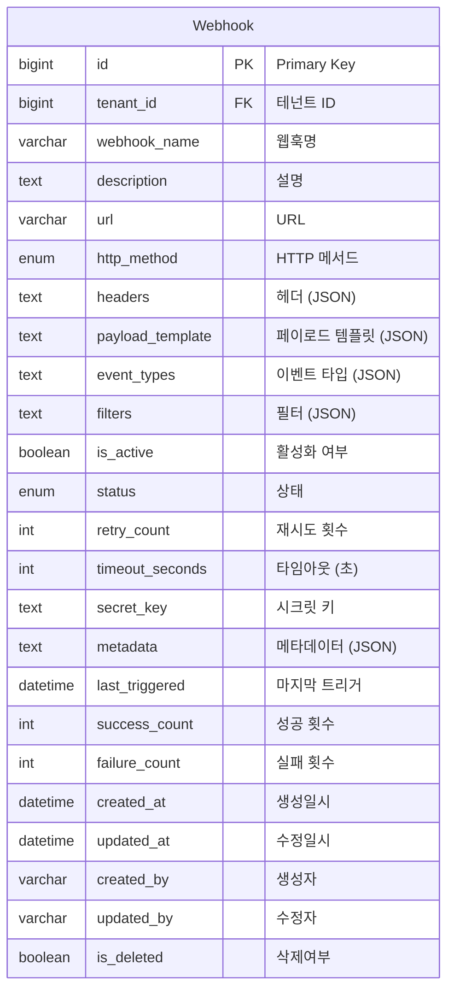
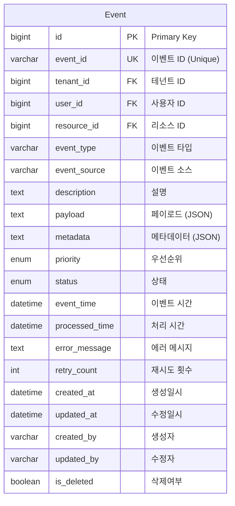
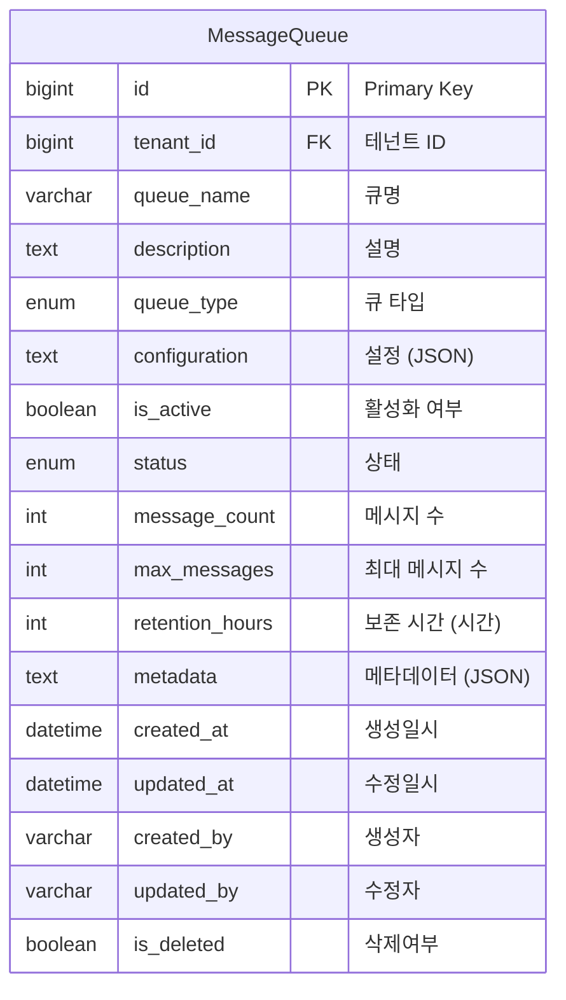

# Integration & API Domain ERD

## 엔티티 관계도



## 주요 엔티티

### ExternalApi (외부 API)


### Webhook (웹훅)


### Event (이벤트)


### MessageQueue (메시지 큐)


## 열거형 (Enums)

### AuthType
```mermaid
erDiagram
    AuthType {
        NONE "없음"
        API_KEY "API 키"
        BASIC "기본 인증"
        BEARER "Bearer 토큰"
        OAUTH2 "OAuth 2.0"
        CUSTOM "사용자 정의"
    }
```

### HttpMethod
```mermaid
erDiagram
    HttpMethod {
        GET "GET"
        POST "POST"
        PUT "PUT"
        PATCH "PATCH"
        DELETE "DELETE"
    }
```

### EventType
```mermaid
erDiagram
    EventType {
        RESOURCE_CREATED "리소스 생성"
        RESOURCE_UPDATED "리소스 수정"
        RESOURCE_DELETED "리소스 삭제"
        USER_LOGIN "사용자 로그인"
        USER_LOGOUT "사용자 로그아웃"
        ALERT_TRIGGERED "알림 트리거"
        COST_THRESHOLD "비용 임계값"
        CUSTOM "사용자 정의"
    }
```

### Priority
```mermaid
erDiagram
    Priority {
        LOW "낮음"
        MEDIUM "보통"
        HIGH "높음"
        CRITICAL "치명적"
    }
```

### QueueType
```mermaid
erDiagram
    QueueType {
        FIFO "FIFO"
        LIFO "LIFO"
        PRIORITY "우선순위"
        ROUND_ROBIN "라운드 로빈"
        CUSTOM "사용자 정의"
    }
```

## 인덱스 전략

### ExternalApi 테이블
- `idx_external_api_tenant`: tenant_id 컬럼
- `idx_external_api_name`: api_name 컬럼
- `idx_external_api_status`: status 컬럼
- `idx_external_api_active`: is_active 컬럼
- `idx_external_api_tenant_active`: (tenant_id, is_active) 복합

### Webhook 테이블
- `idx_webhook_tenant`: tenant_id 컬럼
- `idx_webhook_name`: webhook_name 컬럼
- `idx_webhook_status`: status 컬럼
- `idx_webhook_active`: is_active 컬럼
- `idx_webhook_tenant_active`: (tenant_id, is_active) 복합

### Event 테이블
- `idx_event_id`: event_id 컬럼 (Unique)
- `idx_event_tenant`: tenant_id 컬럼
- `idx_event_user`: user_id 컬럼
- `idx_event_resource`: resource_id 컬럼
- `idx_event_type`: event_type 컬럼
- `idx_event_time`: event_time 컬럼
- `idx_event_status`: status 컬럼
- `idx_event_tenant_time`: (tenant_id, event_time) 복합

### MessageQueue 테이블
- `idx_message_queue_tenant`: tenant_id 컬럼
- `idx_message_queue_name`: queue_name 컬럼
- `idx_message_queue_type`: queue_type 컬럼
- `idx_message_queue_status`: status 컬럼
- `idx_message_queue_active`: is_active 컬럼

## 비즈니스 규칙

1. **API 통합**: 외부 API와의 안전한 통합 관리
2. **웹훅 지원**: 실시간 이벤트 전달을 위한 웹훅 시스템
3. **이벤트 처리**: 비동기 이벤트 처리 및 큐잉
4. **메시지 큐**: 안정적인 메시지 전달을 위한 큐 시스템
5. **재시도 정책**: 실패한 요청에 대한 자동 재시도
6. **속도 제한**: API 호출 속도 제한 및 관리
7. **보안**: API 키 및 인증 정보의 안전한 저장
8. **모니터링**: 통합 상태 및 성능 모니터링
