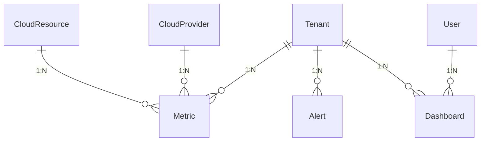
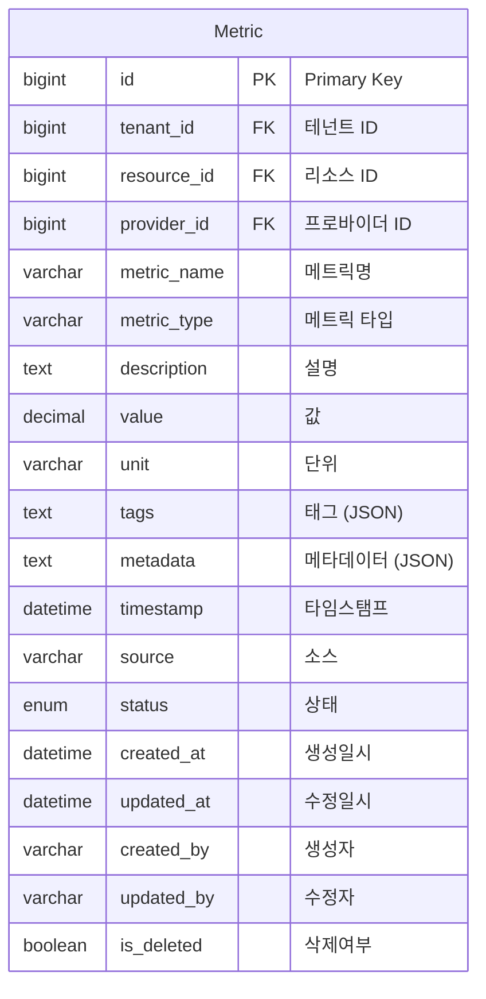
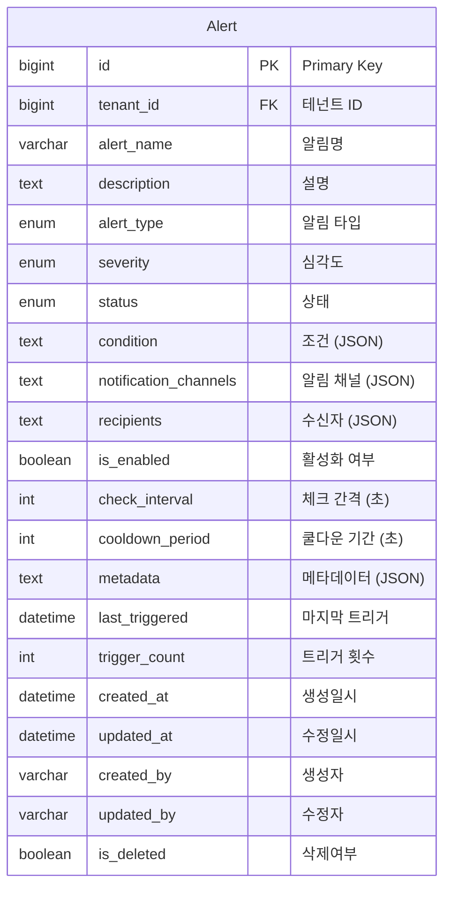
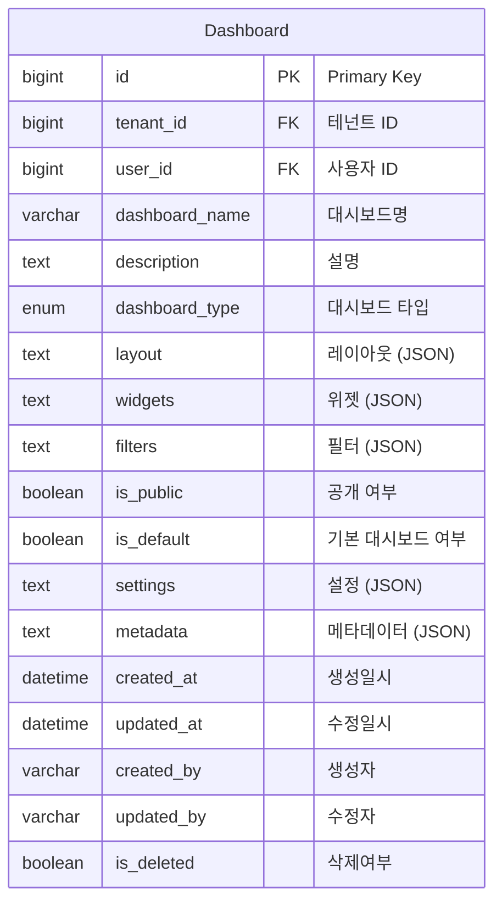

# Monitoring & Analytics Domain ERD

## 엔티티 관계도



## 주요 엔티티

### Metric (메트릭)


### Alert (알림)


### Dashboard (대시보드)


## 열거형 (Enums)

### MetricType
```mermaid
erDiagram
    MetricType {
        COUNTER "카운터"
        GAUGE "게이지"
        HISTOGRAM "히스토그램"
        SUMMARY "요약"
        CUSTOM "사용자 정의"
    }
```

### AlertType
```mermaid
erDiagram
    AlertType {
        THRESHOLD "임계값"
        ANOMALY "이상치"
        TREND "트렌드"
        AVAILABILITY "가용성"
        PERFORMANCE "성능"
        CUSTOM "사용자 정의"
    }
```

### Severity
```mermaid
erDiagram
    Severity {
        INFO "정보"
        WARNING "경고"
        ERROR "에러"
        CRITICAL "치명적"
    }
```

### AlertStatus
```mermaid
erDiagram
    AlertStatus {
        ACTIVE "활성"
        TRIGGERED "트리거됨"
        RESOLVED "해결됨"
        DISABLED "비활성화"
    }
```

### DashboardType
```mermaid
erDiagram
    DashboardType {
        OVERVIEW "개요"
        INFRASTRUCTURE "인프라"
        APPLICATION "애플리케이션"
        SECURITY "보안"
        COST "비용"
        CUSTOM "사용자 정의"
    }
```

## 인덱스 전략

### Metric 테이블
- `idx_metric_tenant`: tenant_id 컬럼
- `idx_metric_resource`: resource_id 컬럼
- `idx_metric_provider`: provider_id 컬럼
- `idx_metric_name`: metric_name 컬럼
- `idx_metric_type`: metric_type 컬럼
- `idx_metric_timestamp`: timestamp 컬럼
- `idx_metric_tenant_timestamp`: (tenant_id, timestamp) 복합
- `idx_metric_resource_timestamp`: (resource_id, timestamp) 복합

### Alert 테이블
- `idx_alert_tenant`: tenant_id 컬럼
- `idx_alert_type`: alert_type 컬럼
- `idx_alert_severity`: severity 컬럼
- `idx_alert_status`: status 컬럼
- `idx_alert_enabled`: is_enabled 컬럼
- `idx_alert_tenant_enabled`: (tenant_id, is_enabled) 복합

### Dashboard 테이블
- `idx_dashboard_tenant`: tenant_id 컬럼
- `idx_dashboard_user`: user_id 컬럼
- `idx_dashboard_type`: dashboard_type 컬럼
- `idx_dashboard_public`: is_public 컬럼
- `idx_dashboard_default`: is_default 컬럼
- `idx_dashboard_tenant_user`: (tenant_id, user_id) 복합

## 비즈니스 규칙

1. **메트릭 수집**: 다양한 소스로부터 실시간 메트릭 수집
2. **알림 관리**: 조건 기반 자동 알림 시스템
3. **대시보드**: 사용자 정의 가능한 모니터링 대시보드
4. **데이터 보존**: 메트릭 데이터의 시간 기반 보존 정책
5. **실시간 모니터링**: 실시간 상태 모니터링 및 알림
6. **트렌드 분석**: 장기 트렌드 분석 및 예측
7. **성능 최적화**: 성능 메트릭 기반 최적화 제안
8. **사용자 권한**: 테넌트별 대시보드 접근 권한 관리
