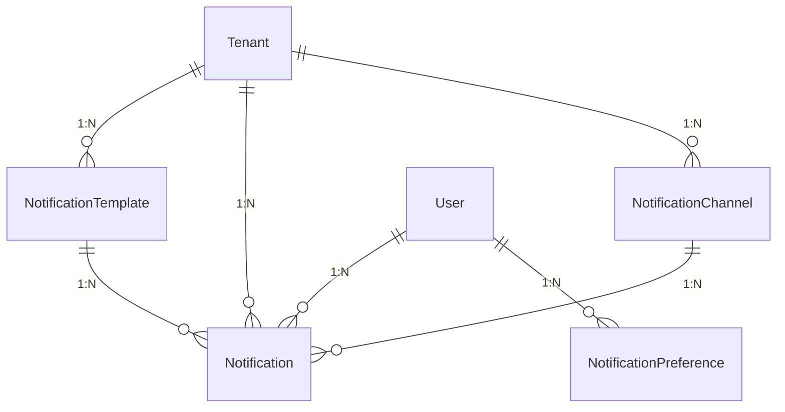
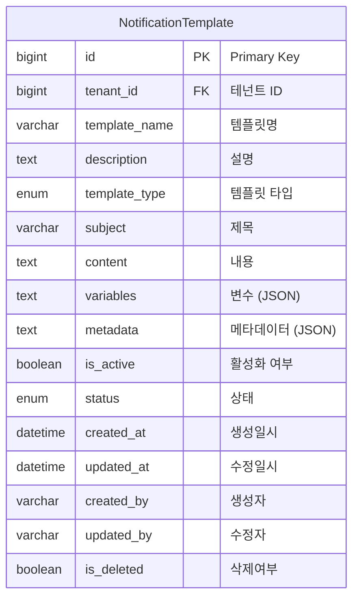
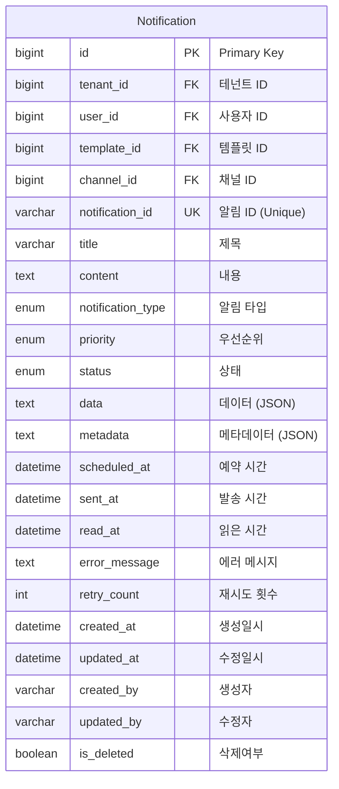
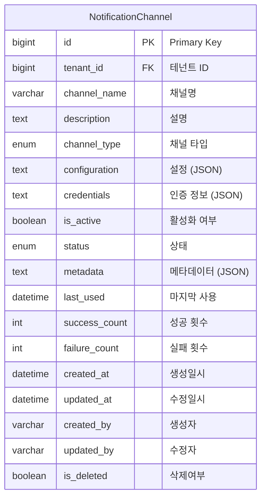
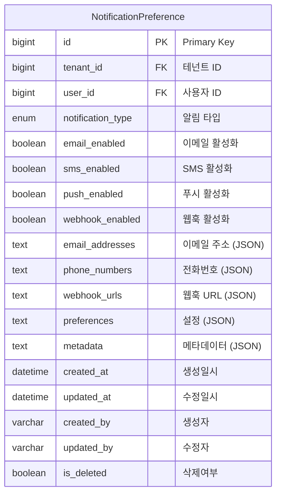
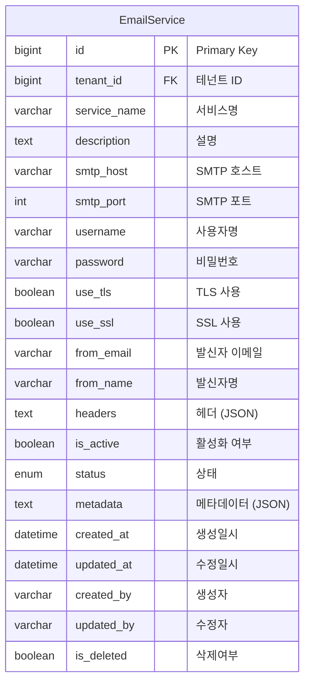

# Notification & Communication Domain ERD

## 엔티티 관계도



## 주요 엔티티

### NotificationTemplate (알림 템플릿)


### Notification (알림)


### NotificationChannel (알림 채널)


### NotificationPreference (알림 설정)


### EmailService (이메일 서비스)


## 열거형 (Enums)

### TemplateType
```mermaid
erDiagram
    TemplateType {
        EMAIL "이메일"
        SMS "SMS"
        PUSH "푸시"
        WEBHOOK "웹훅"
        IN_APP "앱 내"
    }
```

### NotificationType
```mermaid
erDiagram
    NotificationType {
        SYSTEM "시스템"
        SECURITY "보안"
        BILLING "과금"
        MAINTENANCE "유지보수"
        ALERT "알림"
        MARKETING "마케팅"
        CUSTOM "사용자 정의"
    }
```

### ChannelType
```mermaid
erDiagram
    ChannelType {
        EMAIL "이메일"
        SMS "SMS"
        PUSH "푸시"
        WEBHOOK "웹훅"
        SLACK "Slack"
        TEAMS "Microsoft Teams"
        DISCORD "Discord"
        CUSTOM "사용자 정의"
    }
```

### Priority
```mermaid
erDiagram
    Priority {
        LOW "낮음"
        MEDIUM "보통"
        HIGH "높음"
        URGENT "긴급"
    }
```

### NotificationStatus
```mermaid
erDiagram
    NotificationStatus {
        PENDING "대기"
        SENDING "발송중"
        SENT "발송완료"
        DELIVERED "전달완료"
        READ "읽음"
        FAILED "실패"
        CANCELLED "취소"
    }
```

## 인덱스 전략

### NotificationTemplate 테이블
- `idx_notification_template_tenant`: tenant_id 컬럼
- `idx_notification_template_name`: template_name 컬럼
- `idx_notification_template_type`: template_type 컬럼
- `idx_notification_template_status`: status 컬럼
- `idx_notification_template_active`: is_active 컬럼

### Notification 테이블
- `idx_notification_id`: notification_id 컬럼 (Unique)
- `idx_notification_tenant`: tenant_id 컬럼
- `idx_notification_user`: user_id 컬럼
- `idx_notification_type`: notification_type 컬럼
- `idx_notification_status`: status 컬럼
- `idx_notification_priority`: priority 컬럼
- `idx_notification_scheduled`: scheduled_at 컬럼
- `idx_notification_sent`: sent_at 컬럼
- `idx_notification_tenant_user`: (tenant_id, user_id) 복합

### NotificationChannel 테이블
- `idx_notification_channel_tenant`: tenant_id 컬럼
- `idx_notification_channel_name`: channel_name 컬럼
- `idx_notification_channel_type`: channel_type 컬럼
- `idx_notification_channel_status`: status 컬럼
- `idx_notification_channel_active`: is_active 컬럼

### NotificationPreference 테이블
- `idx_notification_preference_tenant`: tenant_id 컬럼
- `idx_notification_preference_user`: user_id 컬럼
- `idx_notification_preference_type`: notification_type 컬럼
- `idx_notification_preference_tenant_user`: (tenant_id, user_id) 복합

### EmailService 테이블
- `idx_email_service_tenant`: tenant_id 컬럼
- `idx_email_service_name`: service_name 컬럼
- `idx_email_service_status`: status 컬럼
- `idx_email_service_active`: is_active 컬럼

## 비즈니스 규칙

1. **템플릿 관리**: 재사용 가능한 알림 템플릿 시스템
2. **채널 지원**: 다양한 알림 채널 통합 관리
3. **사용자 설정**: 개인별 알림 설정 및 선호도 관리
4. **우선순위**: 알림 우선순위 기반 발송 관리
5. **예약 발송**: 미래 시점 알림 예약 기능
6. **재시도 정책**: 실패한 알림에 대한 자동 재시도
7. **상태 추적**: 알림 발송 상태의 완전한 추적
8. **개인화**: 사용자별 맞춤형 알림 내용
