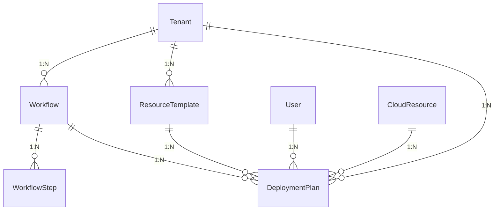
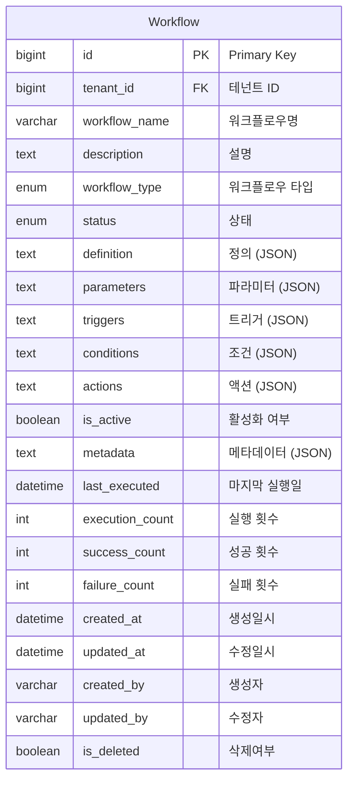
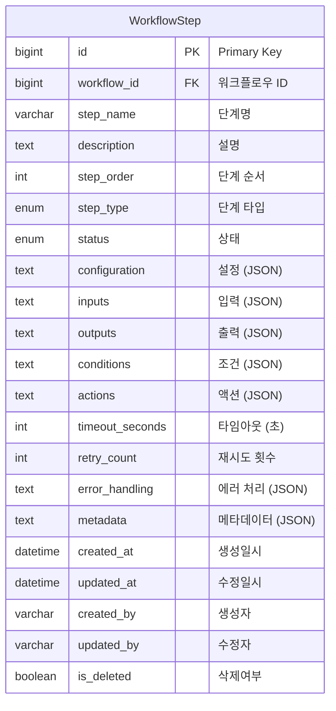
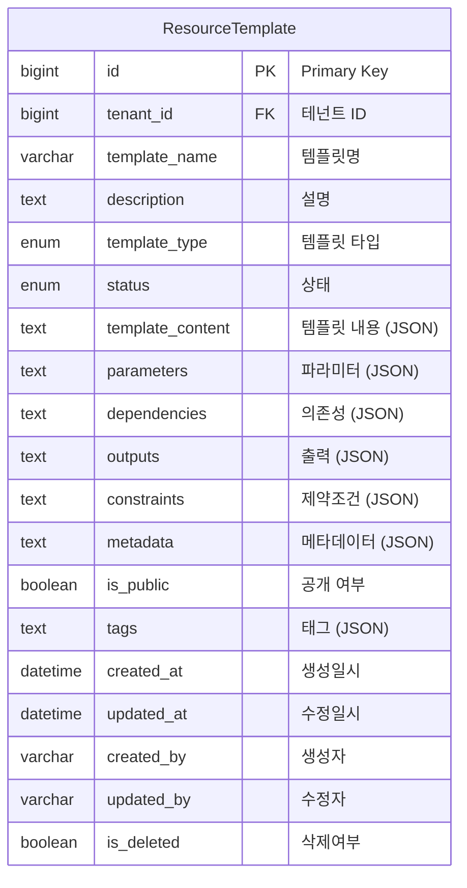
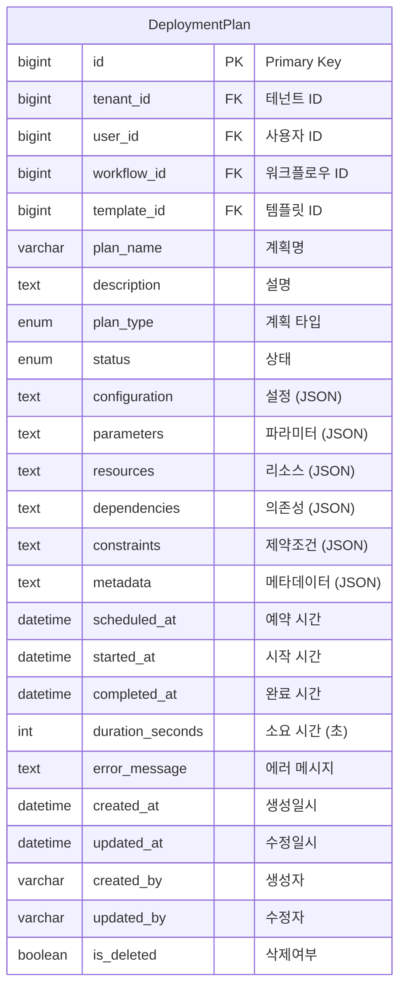
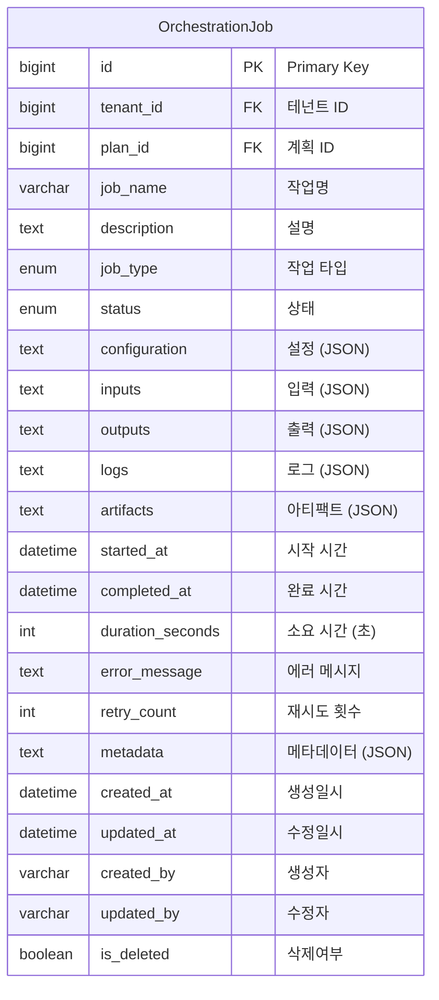

# Resource Orchestration Domain ERD

## 엔티티 관계도



## 주요 엔티티

### Workflow (워크플로우)


### WorkflowStep (워크플로우 단계)


### ResourceTemplate (리소스 템플릿)


### DeploymentPlan (배포 계획)


### OrchestrationJob (오케스트레이션 작업)


## 열거형 (Enums)

### WorkflowType
```mermaid
erDiagram
    WorkflowType {
        DEPLOYMENT "배포"
        SCALING "스케일링"
        BACKUP "백업"
        RESTORE "복원"
        MIGRATION "마이그레이션"
        MAINTENANCE "유지보수"
        CUSTOM "사용자 정의"
    }
```

### StepType
```mermaid
erDiagram
    StepType {
        RESOURCE_CREATE "리소스 생성"
        RESOURCE_UPDATE "리소스 수정"
        RESOURCE_DELETE "리소스 삭제"
        RESOURCE_SCALE "리소스 스케일링"
        RESOURCE_BACKUP "리소스 백업"
        RESOURCE_RESTORE "리소스 복원"
        RESOURCE_MIGRATE "리소스 마이그레이션"
        CUSTOM "사용자 정의"
    }
```

### TemplateType
```mermaid
erDiagram
    TemplateType {
        INFRASTRUCTURE "인프라"
        APPLICATION "애플리케이션"
        DATABASE "데이터베이스"
        NETWORK "네트워크"
        SECURITY "보안"
        MONITORING "모니터링"
        CUSTOM "사용자 정의"
    }
```

### PlanType
```mermaid
erDiagram
    PlanType {
        IMMEDIATE "즉시"
        SCHEDULED "예약"
        CONDITIONAL "조건부"
        MANUAL "수동"
        AUTOMATED "자동화"
    }
```

### JobType
```mermaid
erDiagram
    JobType {
        DEPLOY "배포"
        UPDATE "업데이트"
        DELETE "삭제"
        SCALE "스케일링"
        BACKUP "백업"
        RESTORE "복원"
        MIGRATE "마이그레이션"
        CUSTOM "사용자 정의"
    }
```

## 인덱스 전략

### Workflow 테이블
- `idx_workflow_tenant`: tenant_id 컬럼
- `idx_workflow_name`: workflow_name 컬럼
- `idx_workflow_type`: workflow_type 컬럼
- `idx_workflow_status`: status 컬럼
- `idx_workflow_active`: is_active 컬럼
- `idx_workflow_tenant_status`: (tenant_id, status) 복합

### WorkflowStep 테이블
- `idx_workflow_step_workflow`: workflow_id 컬럼
- `idx_workflow_step_order`: step_order 컬럼
- `idx_workflow_step_type`: step_type 컬럼
- `idx_workflow_step_status`: status 컬럼
- `idx_workflow_step_workflow_order`: (workflow_id, step_order) 복합

### ResourceTemplate 테이블
- `idx_resource_template_tenant`: tenant_id 컬럼
- `idx_resource_template_name`: template_name 컬럼
- `idx_resource_template_type`: template_type 컬럼
- `idx_resource_template_status`: status 컬럼
- `idx_resource_template_public`: is_public 컬럼

### DeploymentPlan 테이블
- `idx_deployment_plan_tenant`: tenant_id 컬럼
- `idx_deployment_plan_user`: user_id 컬럼
- `idx_deployment_plan_workflow`: workflow_id 컬럼
- `idx_deployment_plan_template`: template_id 컬럼
- `idx_deployment_plan_type`: plan_type 컬럼
- `idx_deployment_plan_status`: status 컬럼
- `idx_deployment_plan_scheduled`: scheduled_at 컬럼

### OrchestrationJob 테이블
- `idx_orchestration_job_tenant`: tenant_id 컬럼
- `idx_orchestration_job_plan`: plan_id 컬럼
- `idx_orchestration_job_type`: job_type 컬럼
- `idx_orchestration_job_status`: status 컬럼
- `idx_orchestration_job_started`: started_at 컬럼

## 비즈니스 규칙

1. **워크플로우 관리**: 복잡한 리소스 배포 프로세스 자동화
2. **템플릿 재사용**: 표준화된 리소스 템플릿 관리
3. **배포 계획**: 체계적인 배포 계획 수립 및 실행
4. **의존성 관리**: 리소스 간 의존성 자동 처리
5. **롤백 지원**: 실패 시 자동 롤백 기능
6. **상태 추적**: 실시간 작업 상태 모니터링
7. **에러 처리**: 강력한 에러 처리 및 복구 메커니즘
8. **권한 관리**: 테넌트별 오케스트레이션 권한 제어
