# AgenticCP 멀티 클라우드 플랫폼 전체 ERD

## 전체 도메인 관계도

```mermaid
erDiagram
    %% 공통 엔티티
    BaseEntity ||--o{ Tenant : "상속"
    BaseEntity ||--o{ User : "상속"
    BaseEntity ||--o{ Organization : "상속"
    BaseEntity ||--o{ Role : "상속"
    BaseEntity ||--o{ Permission : "상속"
    BaseEntity ||--o{ CloudProvider : "상속"
    BaseEntity ||--o{ CloudService : "상속"
    BaseEntity ||--o{ CloudRegion : "상속"
    BaseEntity ||--o{ CloudResource : "상속"
    BaseEntity ||--o{ SecurityPolicy : "상속"
    BaseEntity ||--o{ ThreatDetection : "상속"
    BaseEntity ||--o{ Compliance : "상속"
    BaseEntity ||--o{ AuditLog : "상속"
    BaseEntity ||--o{ PlatformConfig : "상속"
    BaseEntity ||--o{ FeatureFlag : "상속"
    BaseEntity ||--o{ License : "상속"
    BaseEntity ||--o{ PlatformHealth : "상속"
    BaseEntity ||--o{ CostAnalysis : "상속"
    BaseEntity ||--o{ Budget : "상속"
    BaseEntity ||--o{ CostOptimization : "상속"
    BaseEntity ||--o{ Metric : "상속"
    BaseEntity ||--o{ Alert : "상속"
    BaseEntity ||--o{ Dashboard : "상속"
    BaseEntity ||--o{ ExternalApi : "상속"
    BaseEntity ||--o{ Webhook : "상속"
    BaseEntity ||--o{ Event : "상속"
    BaseEntity ||--o{ MessageQueue : "상속"
    BaseEntity ||--o{ TerraformTemplate : "상속"
    BaseEntity ||--o{ InfrastructureStack : "상속"
    BaseEntity ||--o{ Deployment : "상속"
    BaseEntity ||--o{ VersionControl : "상속"
    BaseEntity ||--o{ NotificationTemplate : "상속"
    BaseEntity ||--o{ Notification : "상속"
    BaseEntity ||--o{ NotificationChannel : "상속"
    BaseEntity ||--o{ NotificationPreference : "상속"
    BaseEntity ||--o{ EmailService : "상속"
    BaseEntity ||--o{ Workflow : "상속"
    BaseEntity ||--o{ WorkflowStep : "상속"
    BaseEntity ||--o{ ResourceTemplate : "상속"
    BaseEntity ||--o{ DeploymentPlan : "상속"
    BaseEntity ||--o{ OrchestrationJob : "상속"
    BaseEntity ||--o{ Theme : "상속"
    BaseEntity ||--o{ Layout : "상속"
    BaseEntity ||--o{ Component : "상속"
    BaseEntity ||--o{ UserPreference : "상속"
    BaseEntity ||--o{ Widget : "상속"

    %% 핵심 관계
    Tenant ||--o{ User : "1:N"
    Tenant ||--o{ Organization : "1:N"
    Tenant ||--o{ Role : "1:N"
    Tenant ||--o{ Permission : "1:N"
    Tenant ||--o{ CloudResource : "1:N"
    Tenant ||--o{ SecurityPolicy : "1:N"
    Tenant ||--o{ ThreatDetection : "1:N"
    Tenant ||--o{ Compliance : "1:N"
    Tenant ||--o{ AuditLog : "1:N"
    Tenant ||--o{ CostAnalysis : "1:N"
    Tenant ||--o{ Budget : "1:N"
    Tenant ||--o{ CostOptimization : "1:N"
    Tenant ||--o{ Metric : "1:N"
    Tenant ||--o{ Alert : "1:N"
    Tenant ||--o{ Dashboard : "1:N"
    Tenant ||--o{ ExternalApi : "1:N"
    Tenant ||--o{ Webhook : "1:N"
    Tenant ||--o{ Event : "1:N"
    Tenant ||--o{ MessageQueue : "1:N"
    Tenant ||--o{ TerraformTemplate : "1:N"
    Tenant ||--o{ InfrastructureStack : "1:N"
    Tenant ||--o{ Deployment : "1:N"
    Tenant ||--o{ NotificationTemplate : "1:N"
    Tenant ||--o{ Notification : "1:N"
    Tenant ||--o{ NotificationChannel : "1:N"
    Tenant ||--o{ NotificationPreference : "1:N"
    Tenant ||--o{ EmailService : "1:N"
    Tenant ||--o{ Workflow : "1:N"
    Tenant ||--o{ ResourceTemplate : "1:N"
    Tenant ||--o{ DeploymentPlan : "1:N"
    Tenant ||--o{ Theme : "1:N"
    Tenant ||--o{ Layout : "1:N"
    Tenant ||--o{ Component : "1:N"
    Tenant ||--o{ UserPreference : "1:N"
    Tenant ||--o{ Widget : "1:N"

    %% 사용자 관련 관계
    User ||--o{ Organization : "1:N"
    User ||--o{ AuditLog : "1:N"
    User ||--o{ Dashboard : "1:N"
    User ||--o{ Event : "1:N"
    User ||--o{ Deployment : "1:N"
    User ||--o{ DeploymentPlan : "1:N"
    User ||--o{ UserPreference : "1:N"

    %% 조직 관련 관계
    Organization ||--o{ Organization : "1:N (Self-Reference)"
    Organization ||--o{ User : "1:N"

    %% 역할 및 권한 관계
    Role ||--o{ User : "M:N"
    Role ||--o{ Permission : "M:N"
    User ||--o{ Permission : "M:N"

    %% 클라우드 관련 관계
    CloudProvider ||--o{ CloudService : "1:N"
    CloudProvider ||--o{ CloudRegion : "1:N"
    CloudProvider ||--o{ CloudResource : "1:N"
    CloudService ||--o{ CloudResource : "1:N"
    CloudRegion ||--o{ CloudResource : "1:N"

    %% 보안 관련 관계
    SecurityPolicy ||--o{ ThreatDetection : "1:N"
    ThreatDetection ||--o{ Compliance : "1:N"

    %% 모니터링 관련 관계
    Metric ||--o{ Alert : "1:N"
    Alert ||--o{ Dashboard : "1:N"

    %% 통합 관련 관계
    ExternalApi ||--o{ Event : "1:N"
    Webhook ||--o{ Event : "1:N"
    Event ||--o{ MessageQueue : "1:N"

    %% 인프라 관련 관계
    TerraformTemplate ||--o{ InfrastructureStack : "1:N"
    InfrastructureStack ||--o{ Deployment : "1:N"
    TerraformTemplate ||--o{ VersionControl : "1:N"

    %% 오케스트레이션 관련 관계
    Workflow ||--o{ WorkflowStep : "1:N"
    Workflow ||--o{ DeploymentPlan : "1:N"
    ResourceTemplate ||--o{ DeploymentPlan : "1:N"
    DeploymentPlan ||--o{ OrchestrationJob : "1:N"

    %% 알림 관련 관계
    NotificationTemplate ||--o{ Notification : "1:N"
    NotificationChannel ||--o{ Notification : "1:N"
    NotificationPreference ||--o{ Notification : "1:N"

    %% UI 관련 관계
    Theme ||--o{ Layout : "1:N"
    Layout ||--o{ Component : "1:N"
    Dashboard ||--o{ Widget : "1:N"
```

## 도메인별 테이블 수

| 도메인 | 테이블 수 | 주요 엔티티 |
|--------|-----------|-------------|
| **Common** | 1 | BaseEntity |
| **User & Access Management** | 5 | User, Organization, Role, Permission, UserRole, UserPermission, RolePermission |
| **Tenant Management** | 4 | Tenant, TenantConfig, TenantBilling, TenantIsolation |
| **Cloud Management** | 4 | CloudProvider, CloudService, CloudRegion, CloudResource |
| **Security & Compliance** | 4 | SecurityPolicy, ThreatDetection, Compliance, AuditLog |
| **Platform Management** | 4 | PlatformConfig, FeatureFlag, License, PlatformHealth |
| **Cost Management** | 3 | CostAnalysis, Budget, CostOptimization |
| **Monitoring & Analytics** | 3 | Metric, Alert, Dashboard |
| **Integration & API** | 4 | ExternalApi, Webhook, Event, MessageQueue |
| **Infrastructure as Code** | 4 | TerraformTemplate, InfrastructureStack, Deployment, VersionControl |
| **Resource Orchestration** | 5 | Workflow, WorkflowStep, ResourceTemplate, DeploymentPlan, OrchestrationJob |
| **Notification & Communication** | 5 | NotificationTemplate, Notification, NotificationChannel, NotificationPreference, EmailService |
| **UI/UX Management** | 6 | Theme, Layout, Component, UserPreference, Dashboard, Widget |

**총 테이블 수: 48개**

## 핵심 비즈니스 규칙

### 1. 멀티 테넌트 격리
- 모든 비즈니스 엔티티는 `tenant_id`를 통해 테넌트별로 격리
- 테넌트 간 데이터 접근 완전 차단
- 테넌트별 리소스 할당량 관리

### 2. 역할 기반 접근 제어 (RBAC)
- 사용자는 여러 역할을 가질 수 있음 (M:N 관계)
- 역할은 여러 권한을 가질 수 있음 (M:N 관계)
- 사용자는 역할과 별개로 직접 권한을 가질 수 있음

### 3. 클라우드 리소스 관리
- 다양한 클라우드 프로바이더 지원 (AWS, Azure, GCP 등)
- 프로바이더별 서비스 및 리전 관리
- 테넌트별 리소스 격리 및 관리

### 4. 보안 및 컴플라이언스
- 실시간 위협 탐지 및 대응
- 보안 정책 기반 자동 제어
- 완전한 감사 로그 추적

### 5. 비용 관리
- 리소스별 상세 비용 분석
- 예산 설정 및 모니터링
- 자동 비용 최적화 제안

### 6. 모니터링 및 알림
- 실시간 메트릭 수집 및 분석
- 조건 기반 자동 알림
- 사용자 정의 대시보드

### 7. 인프라 자동화
- Terraform 기반 IaC 관리
- 워크플로우 기반 배포 자동화
- 버전 관리 및 롤백 지원

### 8. 통합 및 API
- 외부 API 통합 관리
- 웹훅 기반 실시간 이벤트 처리
- 메시지 큐를 통한 비동기 처리

## 데이터베이스 설계 원칙

### 1. 정규화
- 3NF (Third Normal Form) 준수
- 중복 데이터 최소화
- 참조 무결성 보장

### 2. 인덱스 전략
- 자주 조회되는 컬럼에 인덱스 생성
- 복합 인덱스로 쿼리 성능 최적화
- 테넌트별 조회를 위한 복합 인덱스

### 3. 파티셔닝
- 테넌트별 파티셔닝 고려
- 시간 기반 파티셔닝 (로그 테이블)
- 수평 확장성 고려

### 4. 백업 및 복구
- 정기적인 전체 백업
- 증분 백업으로 효율성 향상
- 테넌트별 백업 및 복구 지원

### 5. 보안
- 민감한 데이터 암호화
- 접근 로그 추적
- 데이터 마스킹 및 익명화

이 ERD는 AgenticCP 멀티 클라우드 플랫폼의 전체 데이터 구조를 보여주며, 각 도메인별 상세 ERD는 해당 도메인의 repository 폴더에서 확인할 수 있습니다.
