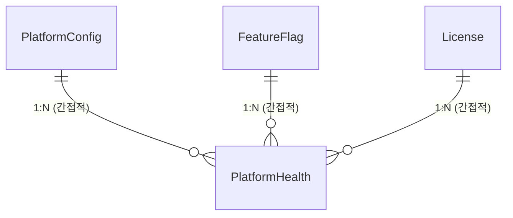
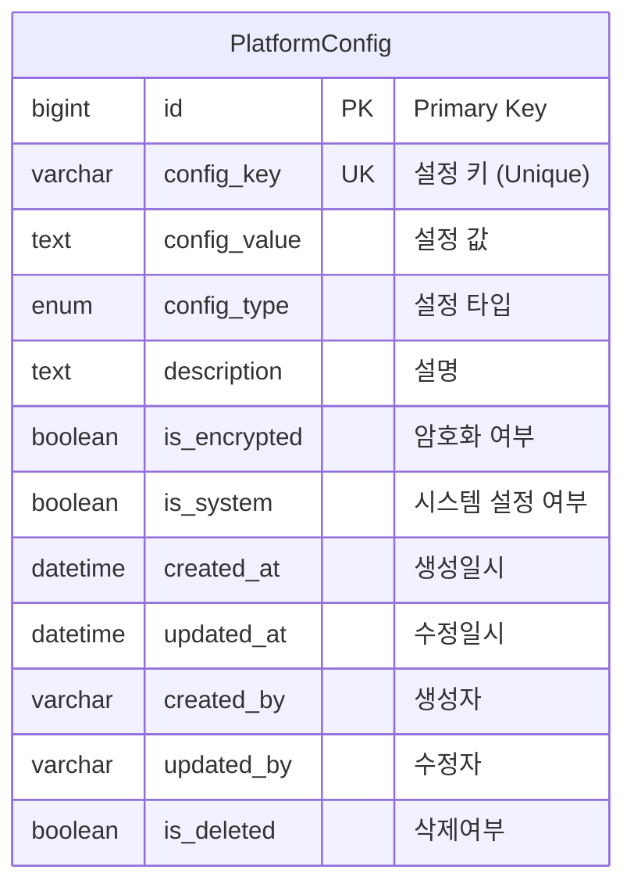
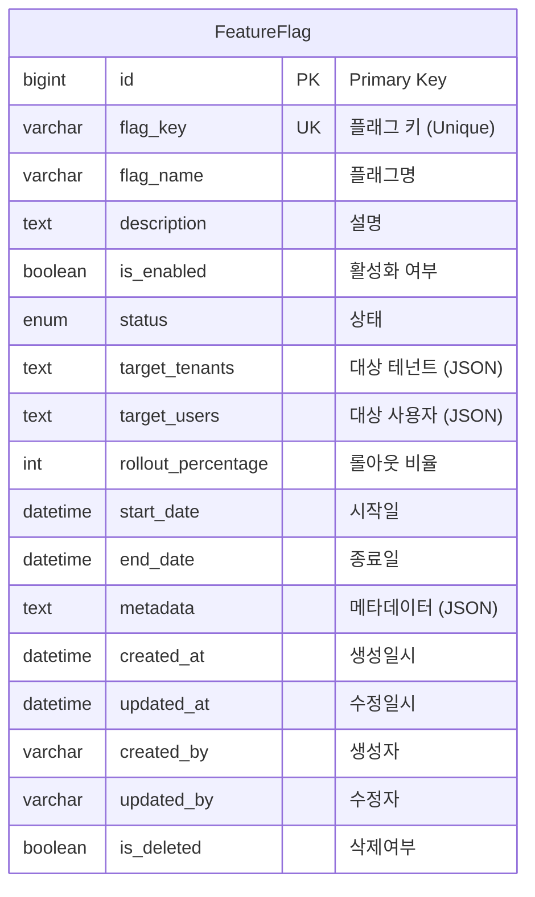
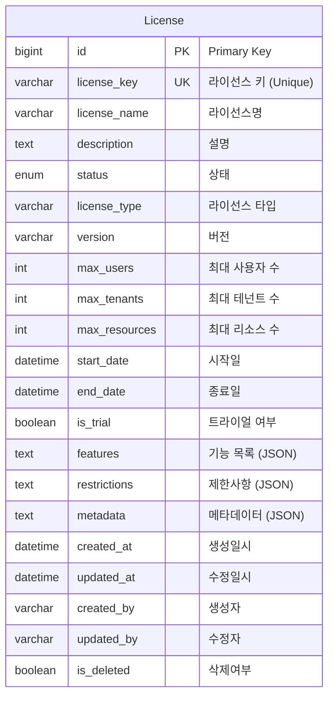
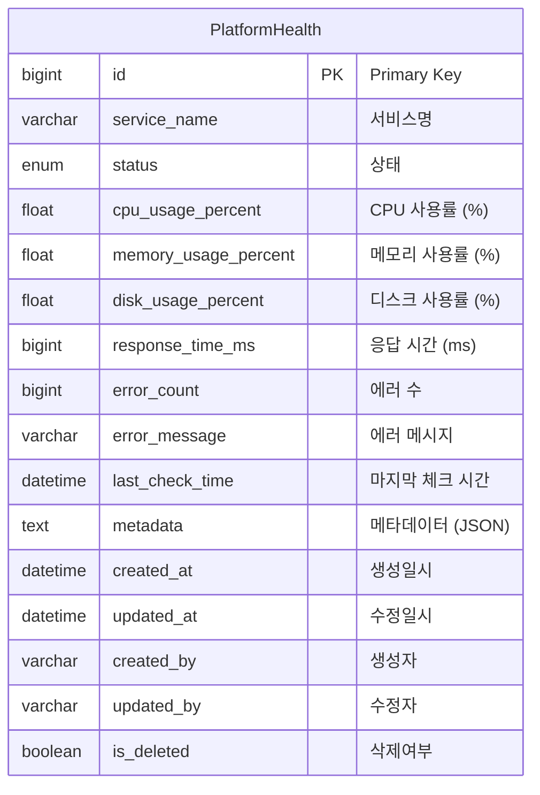

# Platform Management Domain ERD

## 엔티티 관계도



## 주요 엔티티

### PlatformConfig (플랫폼 설정)


### FeatureFlag (기능 플래그)


### License (라이선스)


### PlatformHealth (플랫폼 상태)


## 열거형 (Enums)

### ConfigType
```mermaid
erDiagram
    ConfigType {
        STRING "문자열"
        NUMBER "숫자"
        BOOLEAN "불린"
        JSON "JSON"
        ENCRYPTED "암호화"
    }
```

### LicenseType
```mermaid
erDiagram
    LicenseType {
        TRIAL "트라이얼"
        BASIC "기본"
        PROFESSIONAL "프로페셔널"
        ENTERPRISE "엔터프라이즈"
        GOVERNMENT "정부용"
        CUSTOM "사용자 정의"
    }
```

### HealthStatus
```mermaid
erDiagram
    HealthStatus {
        HEALTHY "정상"
        WARNING "경고"
        CRITICAL "치명적"
        UNKNOWN "알 수 없음"
    }
```

## 인덱스 전략

### PlatformConfig 테이블
- `idx_platform_config_key`: config_key 컬럼 (Unique)
- `idx_platform_config_type`: config_type 컬럼
- `idx_platform_config_system`: is_system 컬럼
- `idx_platform_config_encrypted`: is_encrypted 컬럼

### FeatureFlag 테이블
- `idx_feature_flag_key`: flag_key 컬럼 (Unique)
- `idx_feature_flag_status`: status 컬럼
- `idx_feature_flag_enabled`: is_enabled 컬럼
- `idx_feature_flag_rollout`: rollout_percentage 컬럼
- `idx_feature_flag_dates`: (start_date, end_date) 복합

### License 테이블
- `idx_license_key`: license_key 컬럼 (Unique)
- `idx_license_type`: license_type 컬럼
- `idx_license_status`: status 컬럼
- `idx_license_trial`: is_trial 컬럼
- `idx_license_dates`: (start_date, end_date) 복합

### PlatformHealth 테이블
- `idx_platform_health_service`: service_name 컬럼
- `idx_platform_health_status`: status 컬럼
- `idx_platform_health_check_time`: last_check_time 컬럼
- `idx_platform_health_created`: created_at 컬럼

## 비즈니스 규칙

1. **설정 관리**: 플랫폼 전역 설정의 중앙화된 관리
2. **기능 플래그**: 동적 기능 제어 및 A/B 테스트 지원
3. **라이선스 관리**: 라이선스 검증 및 기능 제한
4. **상태 모니터링**: 실시간 플랫폼 상태 추적
5. **암호화 설정**: 민감한 설정의 암호화 저장
6. **롤아웃 제어**: 점진적 기능 배포 지원
7. **메타데이터**: 설정 및 기능에 대한 상세 정보 저장
8. **버전 관리**: 설정 변경 이력 추적
