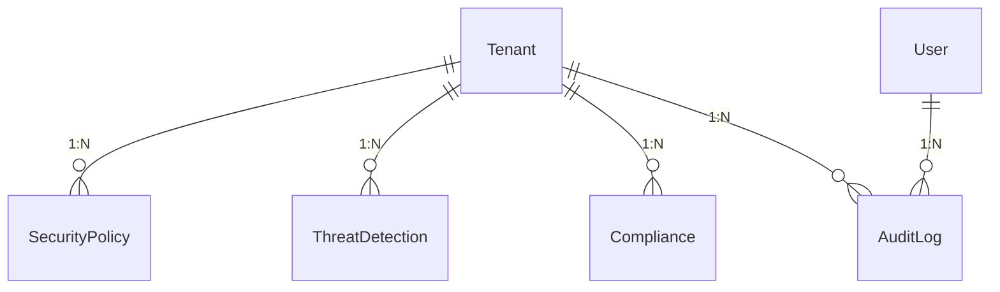
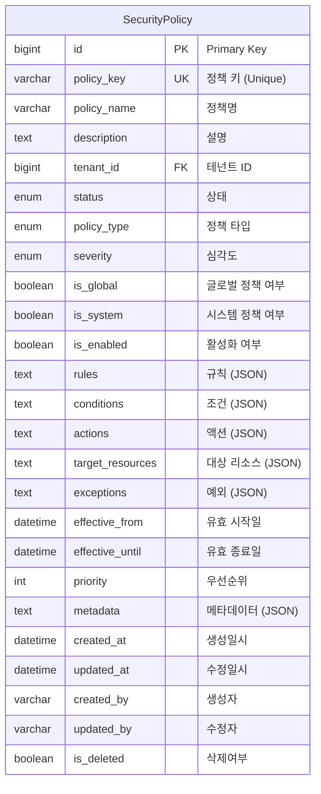
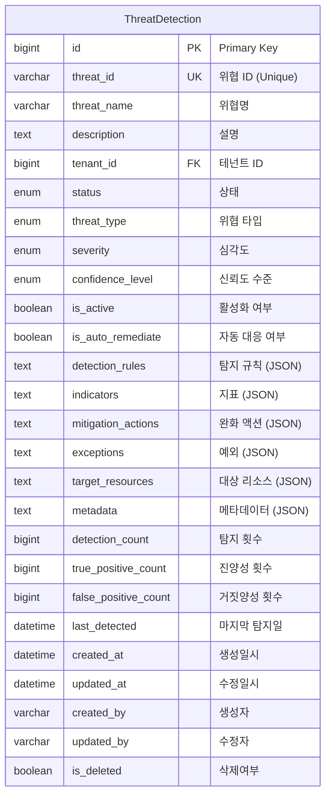
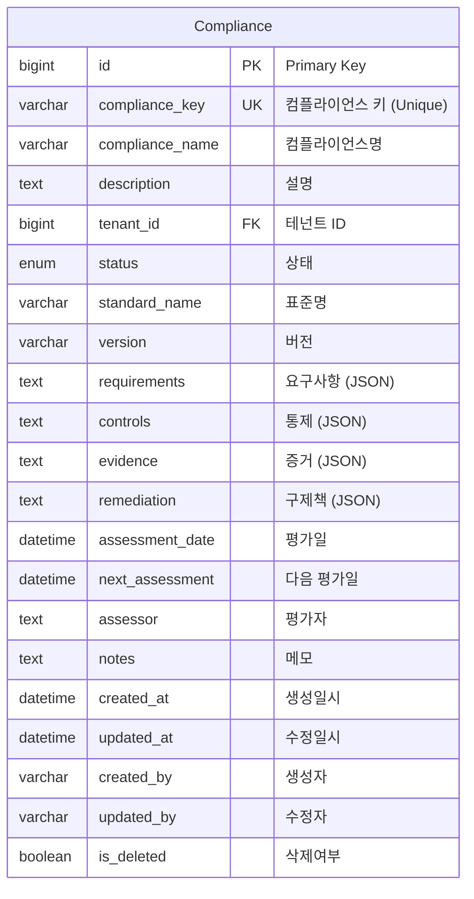
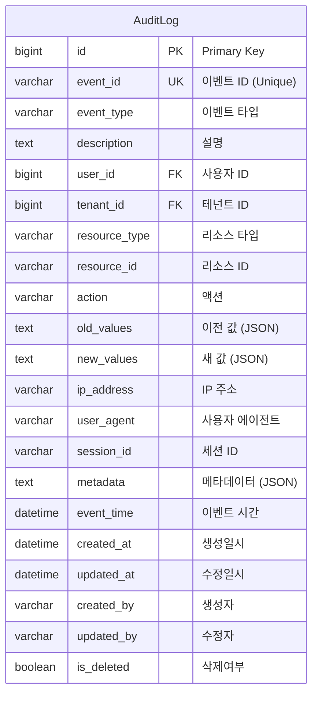

# Security & Compliance Domain ERD

## 엔티티 관계도



## 주요 엔티티

### SecurityPolicy (보안 정책)


### ThreatDetection (위협 탐지)


### Compliance (컴플라이언스)


### AuditLog (감사 로그)


## 열거형 (Enums)

### PolicyType
```mermaid
erDiagram
    PolicyType {
        ACCESS_CONTROL "접근 제어"
        DATA_PROTECTION "데이터 보호"
        NETWORK_SECURITY "네트워크 보안"
        ENCRYPTION "암호화"
        AUTHENTICATION "인증"
        AUTHORIZATION "인가"
        AUDIT_LOGGING "감사 로깅"
        INCIDENT_RESPONSE "사고 대응"
        BACKUP_RECOVERY "백업 복구"
        COMPLIANCE "컴플라이언스"
        VULNERABILITY_MANAGEMENT "취약점 관리"
        THREAT_DETECTION "위협 탐지"
    }
```

### ThreatType
```mermaid
erDiagram
    ThreatType {
        MALWARE "악성코드"
        PHISHING "피싱"
        RANSOMWARE "랜섬웨어"
        DDoS "DDoS 공격"
        SQL_INJECTION "SQL 인젝션"
        XSS "XSS 공격"
        CSRF "CSRF 공격"
        BRUTE_FORCE "무차별 대입"
        UNAUTHORIZED_ACCESS "무단 접근"
        DATA_BREACH "데이터 유출"
        DATA_EXFILTRATION "데이터 반출"
        INSIDER_THREAT "내부자 위협"
        APT "APT 공격"
        BOTNET "봇넷"
        CRYPTOCURRENCY_MINING "암호화폐 채굴"
        CONFIGURATION_DRIFT "설정 변경"
        VULNERABILITY_EXPLOIT "취약점 악용"
        ACCOUNT_TAKEOVER "계정 탈취"
        PRIVILEGE_ESCALATION "권한 상승"
        CUSTOM "사용자 정의"
    }
```

### Severity
```mermaid
erDiagram
    Severity {
        LOW "낮음"
        MEDIUM "보통"
        HIGH "높음"
        CRITICAL "치명적"
    }
```

### ConfidenceLevel
```mermaid
erDiagram
    ConfidenceLevel {
        LOW "낮음"
        MEDIUM "보통"
        HIGH "높음"
        VERY_HIGH "매우 높음"
    }
```

## 인덱스 전략

### SecurityPolicy 테이블
- `idx_security_policy_key`: policy_key 컬럼 (Unique)
- `idx_security_policy_tenant`: tenant_id 컬럼
- `idx_security_policy_type`: policy_type 컬럼
- `idx_security_policy_status`: status 컬럼
- `idx_security_policy_global`: is_global 컬럼
- `idx_security_policy_system`: is_system 컬럼
- `idx_security_policy_enabled`: is_enabled 컬럼
- `idx_security_policy_priority`: priority 컬럼

### ThreatDetection 테이블
- `idx_threat_detection_id`: threat_id 컬럼 (Unique)
- `idx_threat_detection_tenant`: tenant_id 컬럼
- `idx_threat_detection_type`: threat_type 컬럼
- `idx_threat_detection_status`: status 컬럼
- `idx_threat_detection_severity`: severity 컬럼
- `idx_threat_detection_active`: is_active 컬럼
- `idx_threat_detection_last_detected`: last_detected 컬럼

### Compliance 테이블
- `idx_compliance_key`: compliance_key 컬럼 (Unique)
- `idx_compliance_tenant`: tenant_id 컬럼
- `idx_compliance_standard`: standard_name 컬럼
- `idx_compliance_status`: status 컬럼
- `idx_compliance_assessment`: assessment_date 컬럼

### AuditLog 테이블
- `idx_audit_log_event_id`: event_id 컬럼 (Unique)
- `idx_audit_log_user`: user_id 컬럼
- `idx_audit_log_tenant`: tenant_id 컬럼
- `idx_audit_log_event_type`: event_type 컬럼
- `idx_audit_log_event_time`: event_time 컬럼
- `idx_audit_log_resource`: (resource_type, resource_id) 복합
- `idx_audit_log_action`: action 컬럼

## 비즈니스 규칙

1. **정책 우선순위**: 정책은 우선순위에 따라 적용됨
2. **글로벌 정책**: 시스템 전체에 적용되는 글로벌 정책 지원
3. **테넌트 격리**: 테넌트별 보안 정책 격리
4. **위협 탐지**: 실시간 위협 탐지 및 대응
5. **컴플라이언스**: 다양한 보안 표준 준수 관리
6. **감사 추적**: 모든 보안 관련 활동의 완전한 감사 로그
7. **자동 대응**: 위협 탐지 시 자동 대응 메커니즘
8. **정책 버전 관리**: 정책의 변경 이력 추적
