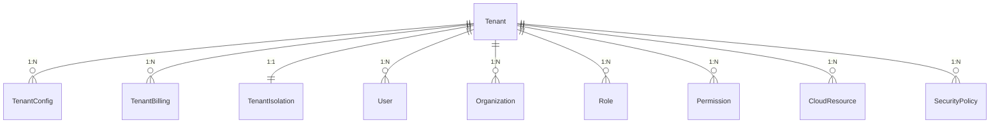
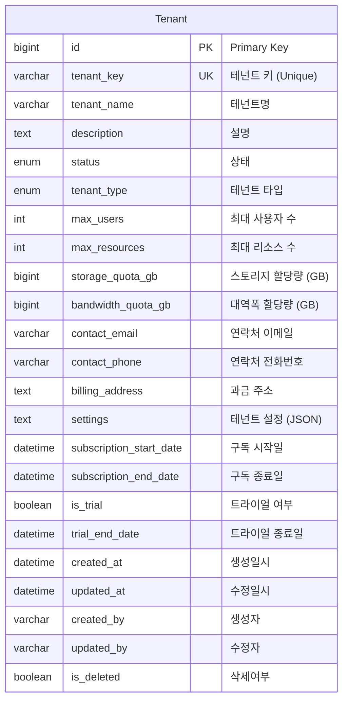
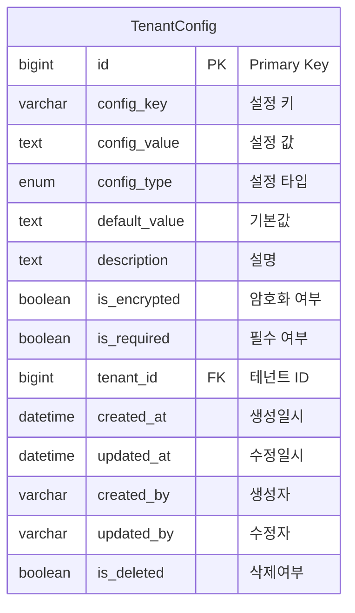
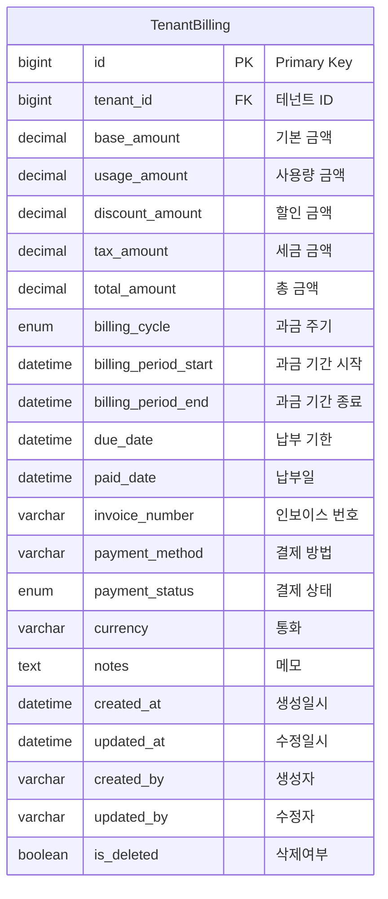
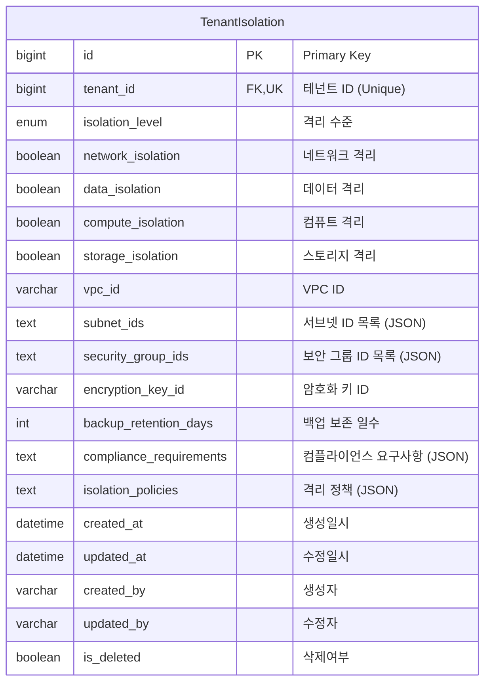

# Tenant Management Domain ERD

## 엔티티 관계도



## 주요 엔티티

### Tenant (테넌트)


### TenantConfig (테넌트 설정)


### TenantBilling (테넌트 과금)


### TenantIsolation (테넌트 격리)


## 열거형 (Enums)

### TenantType
```mermaid
erDiagram
    TenantType {
        INDIVIDUAL "개인"
        SMALL_BUSINESS "소규모 사업체"
        ENTERPRISE "기업"
        GOVERNMENT "정부기관"
    }
```

### BillingCycle
```mermaid
erDiagram
    BillingCycle {
        MONTHLY "월간"
        QUARTERLY "분기별"
        YEARLY "연간"
        USAGE_BASED "사용량 기반"
    }
```

### PaymentStatus
```mermaid
erDiagram
    PaymentStatus {
        PENDING "대기"
        PAID "결제완료"
        OVERDUE "연체"
        CANCELLED "취소"
        REFUNDED "환불"
    }
```

### IsolationLevel
```mermaid
erDiagram
    IsolationLevel {
        SHARED "공유"
        DEDICATED "전용"
        PRIVATE "프라이빗"
        GOVERNMENT "정부용"
    }
```

### ConfigType
```mermaid
erDiagram
    ConfigType {
        STRING "문자열"
        NUMBER "숫자"
        BOOLEAN "불린"
        JSON "JSON"
        ENCRYPTED "암호화"
        EMAIL "이메일"
        URL "URL"
    }
```

## 인덱스 전략

### Tenant 테이블
- `idx_tenant_key`: tenant_key 컬럼 (Unique)
- `idx_tenant_status`: status 컬럼
- `idx_tenant_type`: tenant_type 컬럼
- `idx_tenant_trial`: is_trial 컬럼

### TenantConfig 테이블
- `idx_tenant_config_tenant`: tenant_id 컬럼
- `idx_tenant_config_key`: config_key 컬럼
- `idx_tenant_config_type`: config_type 컬럼

### TenantBilling 테이블
- `idx_tenant_billing_tenant`: tenant_id 컬럼
- `idx_tenant_billing_status`: payment_status 컬럼
- `idx_tenant_billing_due_date`: due_date 컬럼
- `idx_tenant_billing_period`: (billing_period_start, billing_period_end) 복합

### TenantIsolation 테이블
- `idx_tenant_isolation_tenant`: tenant_id 컬럼 (Unique)
- `idx_tenant_isolation_level`: isolation_level 컬럼

## 비즈니스 규칙

1. **테넌트 격리**: 각 테넌트는 완전히 격리된 환경을 가짐
2. **설정 상속**: 테넌트 설정은 플랫폼 기본값을 상속받을 수 있음
3. **과금 모델**: 다양한 과금 주기와 결제 상태를 지원
4. **격리 수준**: 테넌트 요구사항에 따른 다양한 격리 수준 제공
5. **리소스 할당량**: 테넌트별 리소스 사용량 제한
6. **트라이얼 지원**: 신규 테넌트를 위한 트라이얼 기간 제공
