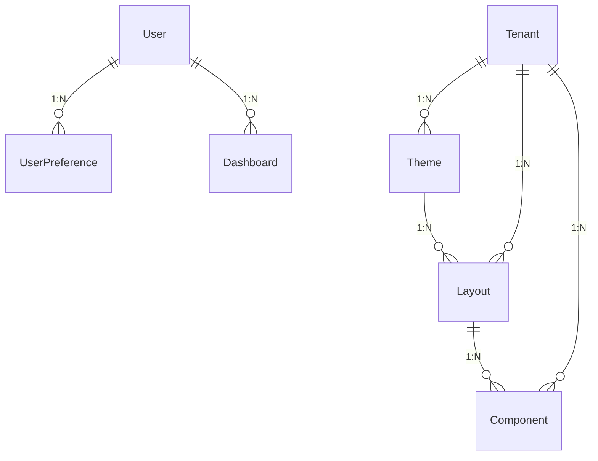
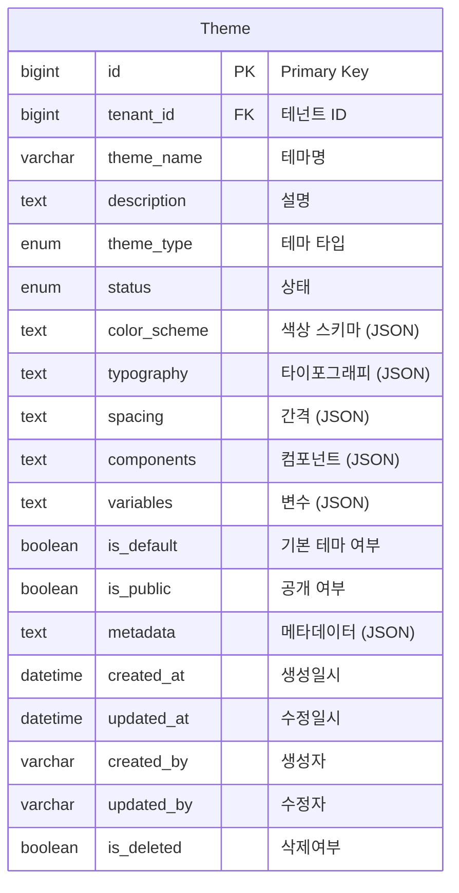
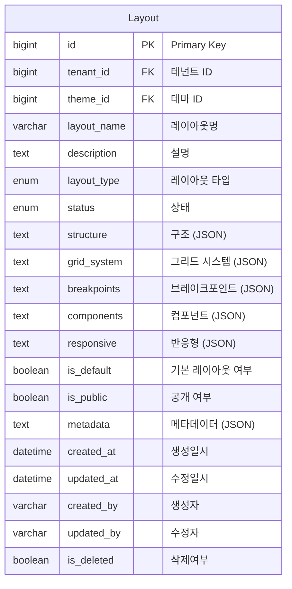
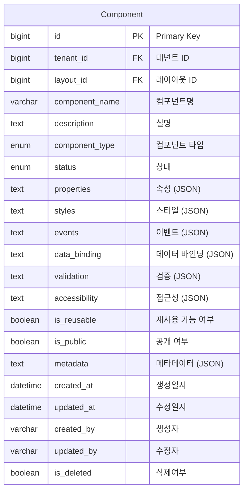
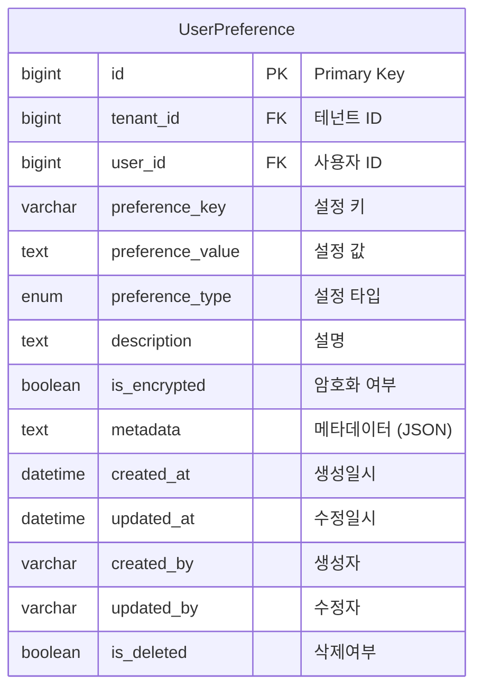
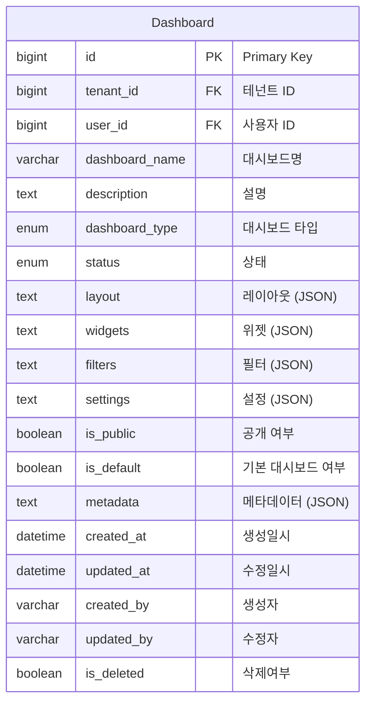
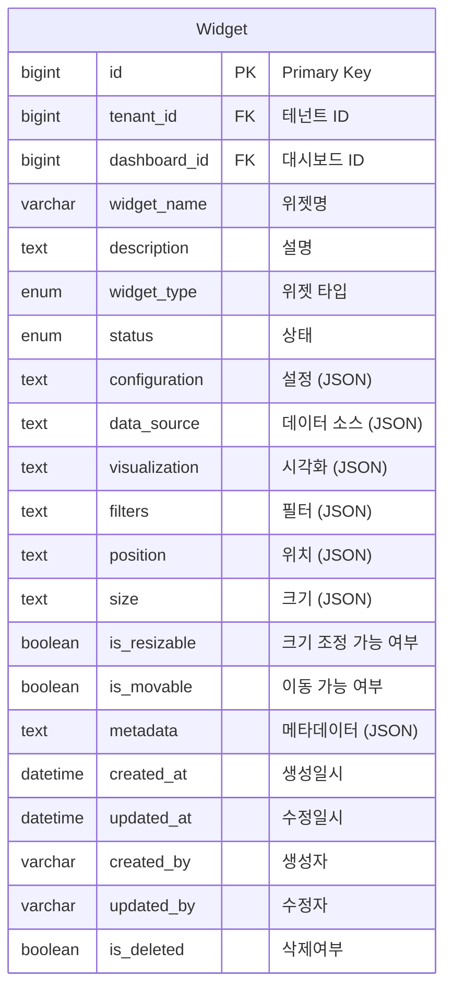

# UI/UX Management Domain ERD

## 엔티티 관계도



## 주요 엔티티

### Theme (테마)


### Layout (레이아웃)


### Component (컴포넌트)


### UserPreference (사용자 설정)


### Dashboard (대시보드)


### Widget (위젯)


## 열거형 (Enums)

### ThemeType
```mermaid
erDiagram
    ThemeType {
        LIGHT "라이트"
        DARK "다크"
        HIGH_CONTRAST "고대비"
        CUSTOM "사용자 정의"
    }
```

### LayoutType
```mermaid
erDiagram
    LayoutType {
        SINGLE_COLUMN "단일 열"
        TWO_COLUMN "두 열"
        THREE_COLUMN "세 열"
        SIDEBAR "사이드바"
        HEADER_FOOTER "헤더 푸터"
        CUSTOM "사용자 정의"
    }
```

### ComponentType
```mermaid
erDiagram
    ComponentType {
        BUTTON "버튼"
        INPUT "입력"
        SELECT "선택"
        TABLE "테이블"
        CHART "차트"
        CARD "카드"
        MODAL "모달"
        NAVIGATION "네비게이션"
        CUSTOM "사용자 정의"
    }
```

### PreferenceType
```mermaid
erDiagram
    PreferenceType {
        THEME "테마"
        LANGUAGE "언어"
        TIMEZONE "시간대"
        LAYOUT "레이아웃"
        NOTIFICATION "알림"
        CUSTOM "사용자 정의"
    }
```

### DashboardType
```mermaid
erDiagram
    DashboardType {
        OVERVIEW "개요"
        INFRASTRUCTURE "인프라"
        APPLICATION "애플리케이션"
        SECURITY "보안"
        COST "비용"
        CUSTOM "사용자 정의"
    }
```

### WidgetType
```mermaid
erDiagram
    WidgetType {
        CHART "차트"
        TABLE "테이블"
        METRIC "메트릭"
        ALERT "알림"
        LOG "로그"
        CUSTOM "사용자 정의"
    }
```

## 인덱스 전략

### Theme 테이블
- `idx_theme_tenant`: tenant_id 컬럼
- `idx_theme_name`: theme_name 컬럼
- `idx_theme_type`: theme_type 컬럼
- `idx_theme_status`: status 컬럼
- `idx_theme_default`: is_default 컬럼
- `idx_theme_public`: is_public 컬럼

### Layout 테이블
- `idx_layout_tenant`: tenant_id 컬럼
- `idx_layout_theme`: theme_id 컬럼
- `idx_layout_name`: layout_name 컬럼
- `idx_layout_type`: layout_type 컬럼
- `idx_layout_status`: status 컬럼
- `idx_layout_default`: is_default 컬럼

### Component 테이블
- `idx_component_tenant`: tenant_id 컬럼
- `idx_component_layout`: layout_id 컬럼
- `idx_component_name`: component_name 컬럼
- `idx_component_type`: component_type 컬럼
- `idx_component_status`: status 컬럼
- `idx_component_reusable`: is_reusable 컬럼

### UserPreference 테이블
- `idx_user_preference_tenant`: tenant_id 컬럼
- `idx_user_preference_user`: user_id 컬럼
- `idx_user_preference_key`: preference_key 컬럼
- `idx_user_preference_type`: preference_type 컬럼
- `idx_user_preference_tenant_user`: (tenant_id, user_id) 복합

### Dashboard 테이블
- `idx_dashboard_tenant`: tenant_id 컬럼
- `idx_dashboard_user`: user_id 컬럼
- `idx_dashboard_name`: dashboard_name 컬럼
- `idx_dashboard_type`: dashboard_type 컬럼
- `idx_dashboard_status`: status 컬럼
- `idx_dashboard_public`: is_public 컬럼
- `idx_dashboard_default`: is_default 컬럼

### Widget 테이블
- `idx_widget_tenant`: tenant_id 컬럼
- `idx_widget_dashboard`: dashboard_id 컬럼
- `idx_widget_name`: widget_name 컬럼
- `idx_widget_type`: widget_type 컬럼
- `idx_widget_status`: status 컬럼

## 비즈니스 규칙

1. **테마 관리**: 일관된 UI/UX를 위한 테마 시스템
2. **레이아웃 관리**: 반응형 레이아웃 시스템
3. **컴포넌트 관리**: 재사용 가능한 UI 컴포넌트 라이브러리
4. **사용자 설정**: 개인화된 UI 설정 관리
5. **대시보드 관리**: 사용자 정의 대시보드 시스템
6. **위젯 관리**: 모듈화된 위젯 시스템
7. **접근성**: 웹 접근성 가이드라인 준수
8. **반응형**: 다양한 디바이스 지원
