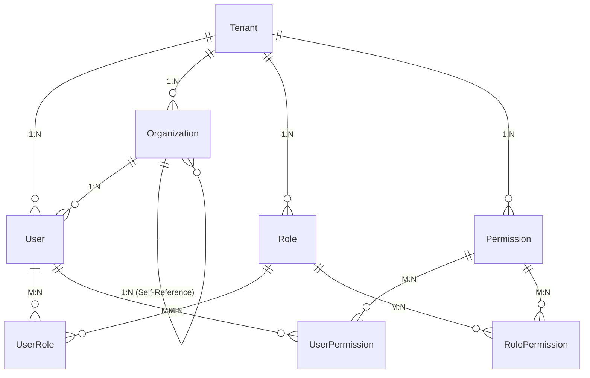
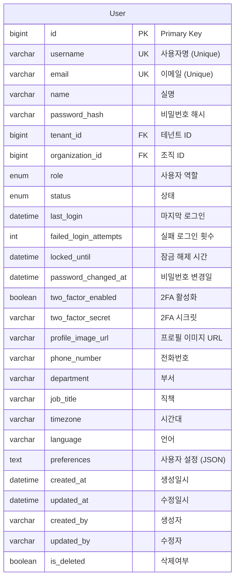
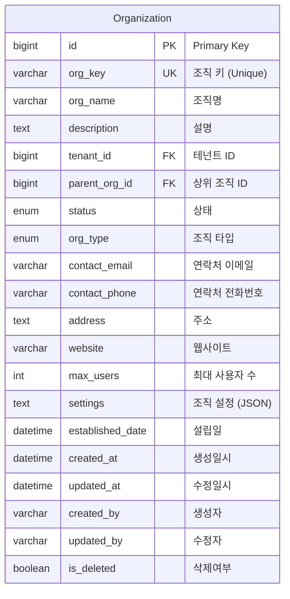
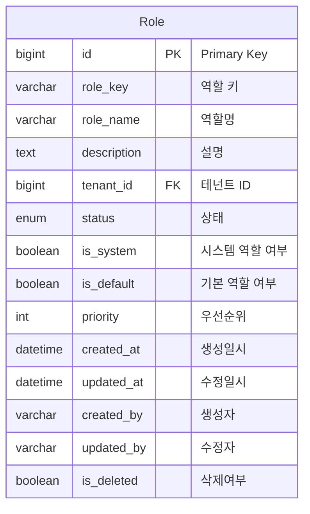
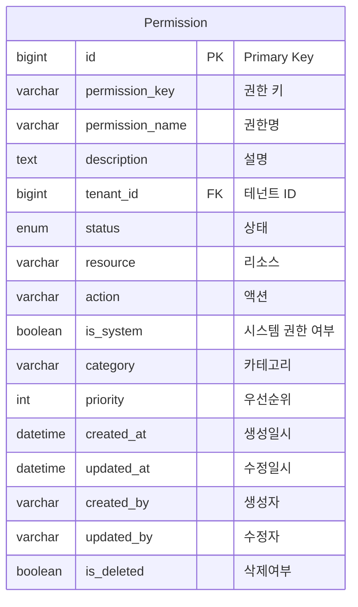
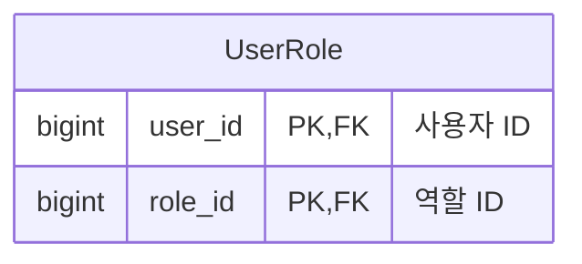
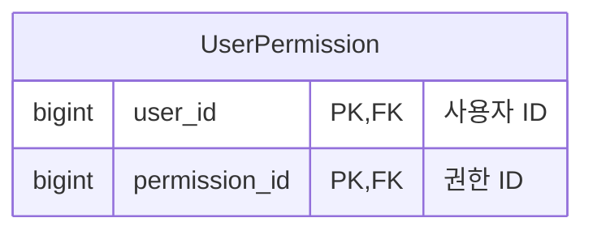
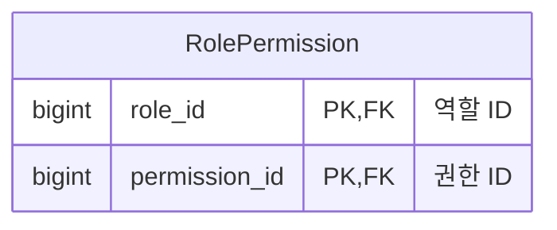

# User & Access Management Domain ERD

## 엔티티 관계도



## 주요 엔티티

### User (사용자)


### Organization (조직)


### Role (역할)


### Permission (권한)


## 중간 테이블

### UserRole (사용자-역할 매핑)


### UserPermission (사용자-권한 매핑)


### RolePermission (역할-권한 매핑)


## 열거형 (Enums)

### UserRole
```mermaid
erDiagram
    UserRole {
        SUPER_ADMIN "최고관리자"
        TENANT_ADMIN "테넌트관리자"
        CLOUD_ADMIN "클라우드관리자"
        DEVELOPER "개발자"
        VIEWER "조회자"
        AUDITOR "감사자"
    }
```

### OrganizationType
```mermaid
erDiagram
    OrganizationType {
        COMPANY "회사"
        DEPARTMENT "부서"
        TEAM "팀"
        PROJECT "프로젝트"
        DIVISION "사업부"
    }
```

## 인덱스 전략

### User 테이블
- `idx_users_username`: username 컬럼
- `idx_users_email`: email 컬럼
- `idx_users_tenant`: tenant_id 컬럼
- `idx_users_active`: status 컬럼
- `idx_users_organization`: organization_id 컬럼

### Organization 테이블
- `idx_org_tenant`: tenant_id 컬럼
- `idx_org_parent`: parent_org_id 컬럼
- `idx_org_status`: status 컬럼

### Role 테이블
- `idx_role_tenant`: tenant_id 컬럼
- `idx_role_system`: is_system 컬럼
- `idx_role_default`: is_default 컬럼

### Permission 테이블
- `idx_permission_tenant`: tenant_id 컬럼
- `idx_permission_resource`: resource 컬럼
- `idx_permission_action`: action 컬럼

## 비즈니스 규칙

1. **사용자-테넌트 관계**: 모든 사용자는 반드시 하나의 테넌트에 속해야 함
2. **조직 계층 구조**: 조직은 자기 참조로 계층 구조를 가질 수 있음
3. **권한 상속**: 사용자는 역할을 통해 권한을 상속받을 수 있음
4. **직접 권한**: 사용자는 역할과 별개로 직접 권한을 가질 수 있음
5. **테넌트 격리**: 모든 엔티티는 테넌트별로 격리됨
